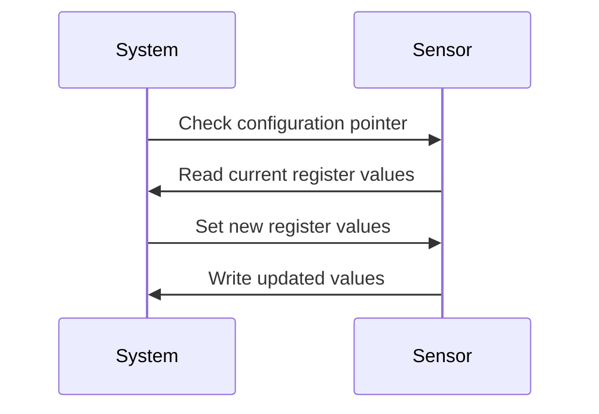
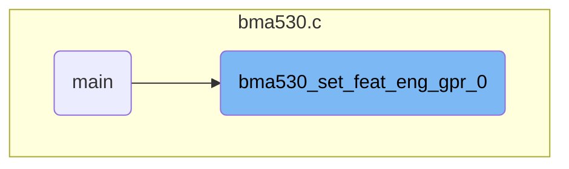
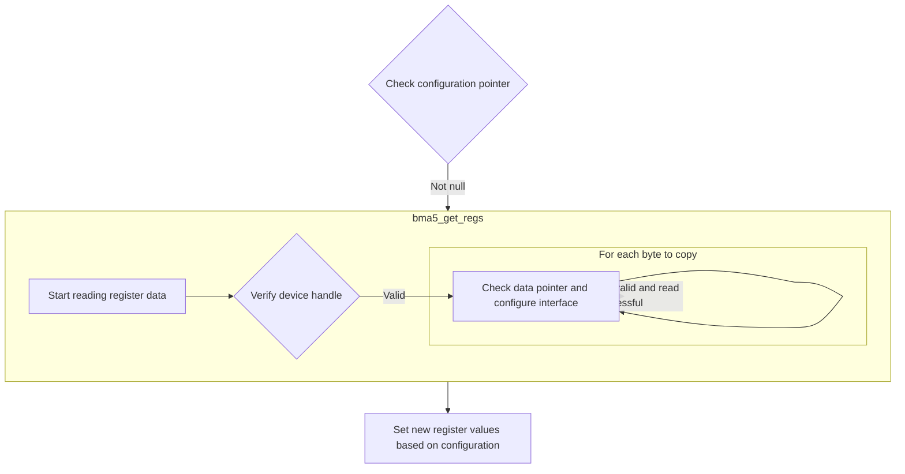
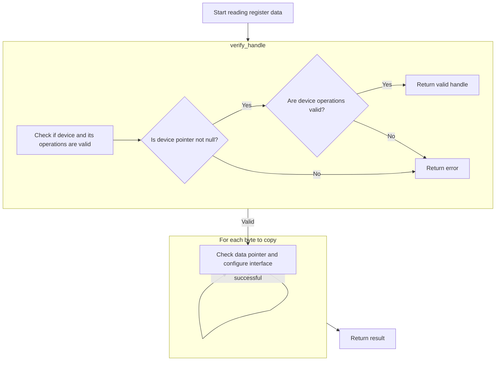
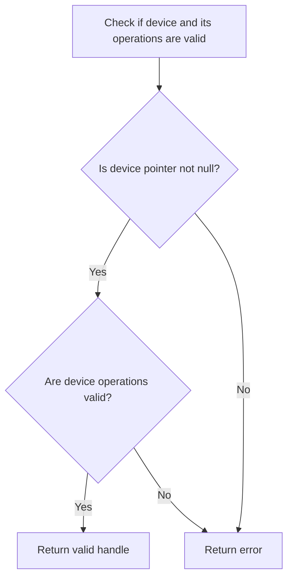
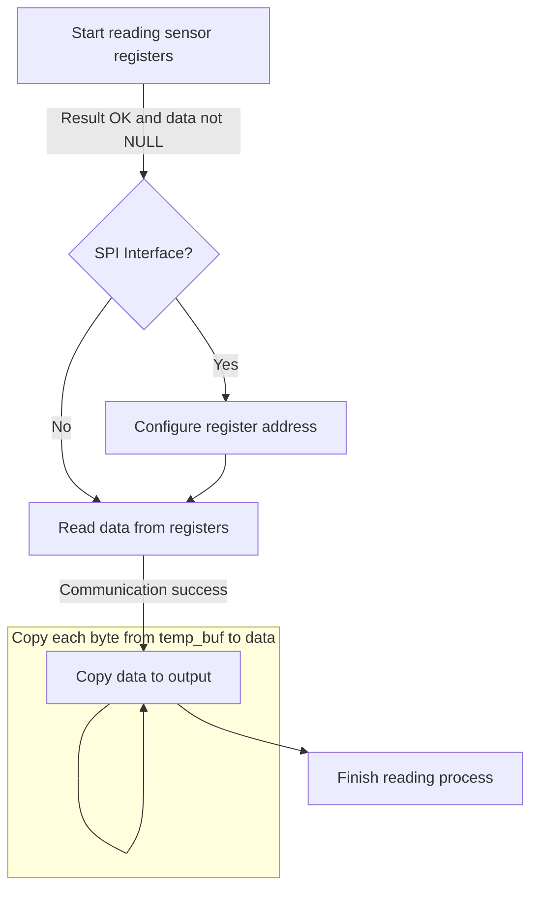
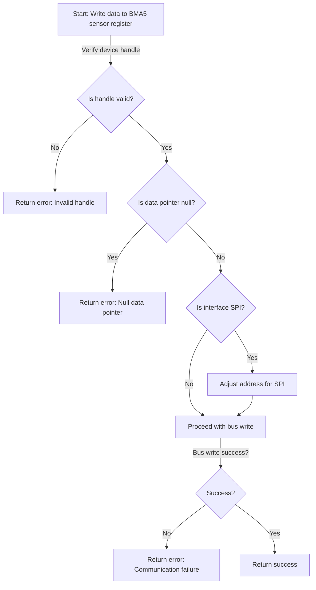

This document describes the process of configuring feature engineering parameters for group 0. The flow involves checking the configuration pointer, reading current register values, setting new values based on the configuration, and writing these values back to the register. For example, if the configuration enables features like step detection and orientation, the register values will be updated to reflect these settings.



# Where is this flow used?

This flow is used multiple times in the codebase as represented in the following diagram:

(Note - these are only some of the entry points of this flow)



# Initializing Feature Engineering Group 0



<SwmSnippet path="/bma530.c" line="396" repo-id="Z2l0aHViJTNBJTNBQk1BNTMwX1NlbnNvckFQSSUzQSUzQVNoYW50YW51TWFuZHBlLUJvc2No">

---

We start the flow by checking if the configuration pointer is null, returning an error if so. Next, we call bma5_get_regs to read the current register value, which is necessary for modifying specific bits based on the configuration.

```c
int8_t bma530_set_feat_eng_gpr_0(const struct bma530_feat_eng_gpr_0 *config, struct bma5_dev *dev)
{
    /* Function execution status */
    int8_t result;

    /* Temporary variable to store the register value to be set */
    uint8_t reg_value = 0;

    uint8_t gen_int1_en, gen_int2_en, gen_int3_en, step_en, sig_mo_en, tilt_en, orient_en, acc_foc_en;

    if (NULL == config)
    {
        result = BMA5_E_NULL_PTR;
    }
    else
    {
        result = bma5_get_regs(BMA530_REG_FEAT_ENG_GPR_0, &reg_value, sizeof(reg_value), dev);

```

---

</SwmSnippet>

## Reading Register Values



<SwmSnippet path="/bma5.c" line="1333" repo-id="Z2l0aHViJTNBJTNBQk1BNTMwX1NlbnNvckFQSSUzQSUzQVNoYW50YW51TWFuZHBlLUJvc2No">

---

Next, we read data from the specified register, initializing a temporary buffer for storage. We call verify_handle to ensure the device handle is valid before proceeding.

```c
 * @brief This API reads the data from the given register address of bma5
 *        sensor.
 */
int8_t bma5_get_regs(uint8_t addr, uint8_t *data, uint32_t len, struct bma5_dev *dev)
{
    /* Function execution status */
    int8_t result;

    /* Temporary buffer to receive the serial data from sensor */
    uint8_t temp_buf[BMA5_MAX_BUFFER_SIZE] = { 0 };

    /* Number of bytes to be copied from temp_buf to data */
    uint32_t bytes_to_copy = len;

    result = verify_handle(dev);
```

---

</SwmSnippet>

### Validating Device Handle



<SwmSnippet path="/bma5.c" line="1698" repo-id="Z2l0aHViJTNBJTNBQk1BNTMwX1NlbnNvckFQSSUzQSUzQVNoYW50YW51TWFuZHBlLUJvc2No">

---

This is the implementation of verify_handle, returning a success code if the device and its function pointers are valid, otherwise returning an error for a null pointer.

```c
/*********************** Static function definitions **************************/
/******************************************************************************/
static int8_t verify_handle(const struct bma5_dev *dev)
{
    /* Function execution status */
    int8_t result = BMA5_E_NULL_PTR;

    if (NULL != dev)
    {
        if ((NULL != dev->bus_read) && (NULL != dev->bus_write) && (NULL != dev->delay_us))
        {
            result = BMA5_OK;
        }
    }

    return result;
}
```

---

</SwmSnippet>

### Processing Register Read



<SwmSnippet path="/bma5.c" line="1348" repo-id="Z2l0aHViJTNBJTNBQk1BNTMwX1NlbnNvckFQSSUzQSUzQVNoYW50YW51TWFuZHBlLUJvc2No">

---

Back in bma5_get_regs, after verify_handle, we check the data pointer and configure the register address for SPI. We perform the read operation and ensure communication success before copying data.

```c
    if ((BMA5_OK == result) && (NULL == data))
    {
        result = BMA5_E_NULL_PTR;
    }

    if (BMA5_OK == result)
    {
        /* Configuring register address for SPI Interface */
        if (BMA5_SPI_INTF == dev->intf)
        {
            addr = addr | BMA5_SPI_RD_MSK;
        }

        dev->intf_rslt = dev->bus_read(addr, temp_buf, (len + dev->dummy_byte), dev->intf_ptr);

        if (BMA5_INTF_RET_SUCCESS != dev->intf_rslt)
        {
            result = BMA5_E_COM_FAIL;
        }
    }

    if (BMA5_OK == result)
    {
        while (bytes_to_copy--)
        {
            data[bytes_to_copy] = temp_buf[bytes_to_copy + dev->dummy_byte];
        }
```

---

</SwmSnippet>

## Configuring Feature Engineering Parameters

<SwmSnippet path="/bma530.c" line="414" repo-id="Z2l0aHViJTNBJTNBQk1BNTMwX1NlbnNvckFQSSUzQSUzQVNoYW50YW51TWFuZHBlLUJvc2No">

---

Back in bma530_set_feat_eng_gpr_0, after bma5_get_regs, we set up the register value based on configuration. We call bma5_set_regs to write the new value, applying the changes.

```c
        if (BMA5_OK == result)
        {
            /* Bring up the register value to be set, as per the input details */
            gen_int1_en =
                (BMA5_SET_BITS_POS_0(reg_value, BMA530_GEN_INT1_EN, config->gen_int1_en) & BMA530_GEN_INT1_EN_MSK);
            gen_int2_en = (BMA5_SET_BITS(reg_value, BMA530_GEN_INT2_EN, config->gen_int2_en) & BMA530_GEN_INT2_EN_MSK);
            gen_int3_en = (BMA5_SET_BITS(reg_value, BMA530_GEN_INT3_EN, config->gen_int3_en) & BMA530_GEN_INT3_EN_MSK);
            step_en = (BMA5_SET_BITS(reg_value, BMA530_STEP_EN, config->step_en) & BMA530_STEP_EN_MSK);
            sig_mo_en = (BMA5_SET_BITS(reg_value, BMA530_SIG_MO_EN, config->sig_mo_en) & BMA530_SIG_MO_EN_MSK);
            tilt_en = (BMA5_SET_BITS(reg_value, BMA530_TILT_EN, config->tilt_en) & BMA530_TILT_EN_MSK);
            orient_en = (BMA5_SET_BITS(reg_value, BMA530_ORIENT_EN, config->orient_en) & BMA530_ORIENT_EN_MSK);
            acc_foc_en = (BMA5_SET_BITS(reg_value, BMA530_ACC_FOC_EN, config->acc_foc_en) & BMA530_ACC_FOC_EN_MSK);

            reg_value =
                (uint8_t)(gen_int1_en | gen_int2_en | gen_int3_en | step_en | sig_mo_en | tilt_en | orient_en |
                          acc_foc_en);

            result = bma5_set_regs(BMA530_REG_FEAT_ENG_GPR_0, (const uint8_t *)&reg_value, sizeof(reg_value), dev);
        }
    }

    return result;
}
```

---

</SwmSnippet>

# Writing Register Values



<SwmSnippet path="/bma5.c" line="1381" repo-id="Z2l0aHViJTNBJTNBQk1BNTMwX1NlbnNvckFQSSUzQSUzQVNoYW50YW51TWFuZHBlLUJvc2No">

---

First, we write data to the specified register, calling verify_handle to ensure the device handle is valid before proceeding.

```c
 * @brief This API writes data to the given register address of bma5 sensor.
 */
int8_t bma5_set_regs(uint8_t addr, const uint8_t *data, uint32_t len, struct bma5_dev *dev)
{
    /* Function execution status */
    int8_t result;

    result = verify_handle(dev);
```

---

</SwmSnippet>

<SwmSnippet path="/bma5.c" line="1389" repo-id="Z2l0aHViJTNBJTNBQk1BNTMwX1NlbnNvckFQSSUzQSUzQVNoYW50YW51TWFuZHBlLUJvc2No">

---

Back in bma5_set_regs, after verify_handle, we check the data pointer and configure the register address for SPI. We perform the write operation and ensure communication success before returning the result.

```c
    if ((BMA5_OK == result) && (NULL == data))
    {
        result = BMA5_E_NULL_PTR;
    }

    if (BMA5_OK == result)
    {
        /* Configuring register address for SPI Interface */
        if (BMA5_SPI_INTF == dev->intf)
        {
            addr = (addr & BMA5_SPI_WR_MSK);
        }

        dev->intf_rslt = dev->bus_write(addr, data, len, dev->intf_ptr);

        if (BMA5_INTF_RET_SUCCESS != dev->intf_rslt)
        {
            result = BMA5_E_COM_FAIL;
        }
    }

    return result;
}
```

---

</SwmSnippet>

&nbsp;

*This is an auto-generated document by Swimm 🌊 and has not yet been verified by a human*

<SwmMeta version="3.0.0"><sup>Powered by [Swimm](https://app.swimm.io/)</sup></SwmMeta>
