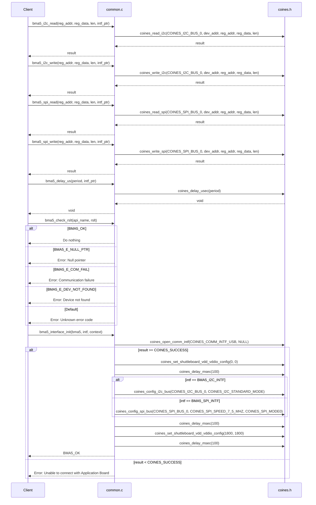
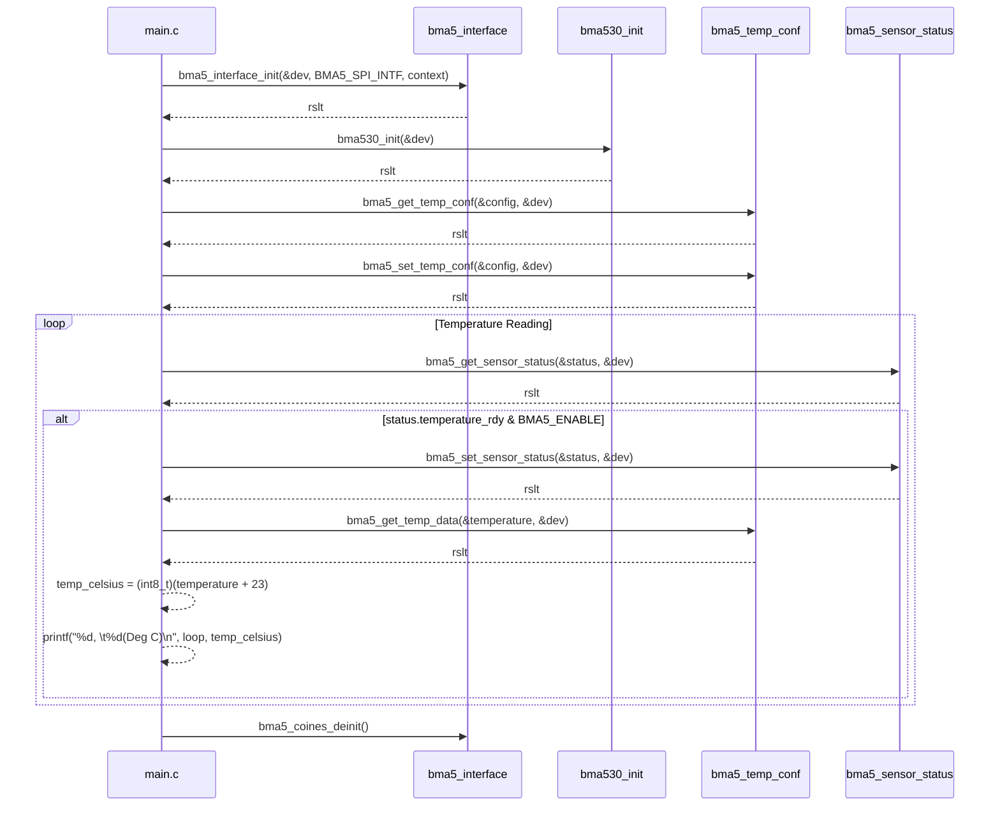

# Functional Documentation

<SwmSnippet path="/examples/common/common.c" line="34">

---

Here we include standard libraries and headers for `bma5`, `coines`, and `common`, allowing access to their functionalities in the code.

```c
#include <stdint.h>
#include <stdlib.h>
#include <stdio.h>

#include "bma5.h"
#include "coines.h"
#include "common.h"
```

---

</SwmSnippet>

## I2C Communication Functions

<SwmSnippet path="/examples/common/common.c" line="48">

---

Here we read data from a specified register using `coines_read_i2c`, with the device address obtained from `intf_ptr`.

```c
BMA5_INTF_RET_TYPE bma5_i2c_read(uint8_t reg_addr, uint8_t *reg_data, uint32_t len, void *intf_ptr)
{
    uint8_t dev_addr = *(uint8_t*)intf_ptr;

    return coines_read_i2c(COINES_I2C_BUS_0, dev_addr, reg_addr, reg_data, (uint16_t)len);
}
```

---

</SwmSnippet>

<SwmSnippet path="/examples/common/common.c" line="58">

---

Here we perform an I2C write operation using `coines_write_i2c` to send data to a specific device address, identified by `dev_addr`, at a given register address `reg_addr`.

```c
BMA5_INTF_RET_TYPE bma5_i2c_write(uint8_t reg_addr, const uint8_t *reg_data, uint32_t len, void *intf_ptr)
{
    uint8_t dev_addr = *(uint8_t*)intf_ptr;

    return coines_write_i2c(COINES_I2C_BUS_0, dev_addr, reg_addr, (uint8_t *)reg_data, (uint16_t)len);
}
```

---

</SwmSnippet>

## SPI Communication Functions

<SwmSnippet path="/examples/common/common.c" line="68">

---

Here we perform SPI read and write operations using `coines_read_spi` and `coines_write_spi` functions with a device address derived from `intf_ptr`.

```c
BMA5_INTF_RET_TYPE bma5_spi_read(uint8_t reg_addr, uint8_t *reg_data, uint32_t len, void *intf_ptr)
{
    uint8_t dev_addr = *(uint8_t*)intf_ptr;

    return coines_read_spi(COINES_SPI_BUS_0, dev_addr, reg_addr, reg_data, (uint16_t)len);
}

/*!
 * @brief SPI write function map to COINES platform
 */
BMA5_INTF_RET_TYPE bma5_spi_write(uint8_t reg_addr, const uint8_t *reg_data, uint32_t len, void *intf_ptr)
{
    uint8_t dev_addr = *(uint8_t*)intf_ptr;

    return coines_write_spi(COINES_SPI_BUS_0, dev_addr, reg_addr, (uint8_t *)reg_data, (uint16_t)len);
}
```

---

</SwmSnippet>

## Error Check and Delay Functions

<SwmSnippet path="/examples/common/common.c" line="93">

---

Here we handle various outcomes of a function by printing messages based on the value of `rslt`, including details about the `api_name`.

```c
void bma5_check_rslt(const char api_name[], int8_t rslt)
{
    switch (rslt)
    {
        case BMA5_OK:

            /* Do nothing */
            break;
        case BMA5_E_NULL_PTR:
            printf("API name %s\t", api_name);
            printf("Error  [%d] : Null pointer\r\n", rslt);
            break;
        case BMA5_E_COM_FAIL:
            printf("API name %s\t", api_name);
            printf("Error  [%d] : Communication failure\r\n", rslt);
            break;
        case BMA5_E_DEV_NOT_FOUND:
            printf("API name %s\t", api_name);
            printf("Error  [%d] : Device not found\r\n", rslt);
            break;
        default:
            printf("API name %s\t", api_name);
            printf("Error  [%d] : Unknown error code\r\n", rslt);
            break;
    }
}
```

---

</SwmSnippet>

<SwmSnippet path="/examples/common/common.c" line="88">

---

Here we call `coines_delay_usec` to create a delay for the specified `period` in microseconds.

```c
void bma5_delay_us(uint32_t period, void *intf_ptr)
{
    coines_delay_usec(period);
}
```

---

</SwmSnippet>

## BMA5 Interface Initialization Function

In the \`<SwmToken path="/examples/common/common.c" pos="120:2:2" line-data="int8_t bma5_interface_init(struct bma5_dev *bma5, uint8_t intf, enum bma5_context context)">`bma5_interface_init`</SwmToken>  we initialize the `bma5` device by setting up communication interfaces (I2C or SPI), configuring power settings, and assigning function pointers for read and write operations.

<SwmSnippet path="/examples/common/common.c" line="122">

---

Here we open a USB communication interface and check if the connection to the application board is successful, providing instructions if it fails.

```
    int8_t rslt = BMA5_OK;

    if (bma5 != NULL)
    {
        int16_t result = coines_open_comm_intf(COINES_COMM_INTF_USB, NULL);

        if (result < COINES_SUCCESS)
        {
            printf(
                "\n Unable to connect with Application Board ! \n" " 1. Check if the board is connected and powered on. \n" " 2. Check if Application Board USB driver is installed. \n"
                " 3. Check if board is in use by another application. (Insufficient permissions to access USB) \n");
            exit(result);
        }
```

---

</SwmSnippet>

<SwmSnippet path="/examples/common/common.c" line="135">

---

Here we configure the `VDD` and `VDDIO` settings and then pause the execution for 100 milliseconds.

```

        coines_set_shuttleboard_vdd_vddio_config(0, 0);
        coines_delay_msec(100);

```

---

</SwmSnippet>

<SwmSnippet path="/examples/common/common.c" line="139">

---

Here we configure the bus interface for the device based on the `intf` type, setting up `I2C` or `SPI` communication, and defining the corresponding read and write functions.

```
        /* Bus configuration : I2C */
        if (intf == BMA5_I2C_INTF)
        {
            printf("I2C Interface \n");

            dev_addr = BMA5_I2C_ADDRESS;
            bma5->bus_read = bma5_i2c_read;
            bma5->bus_write = bma5_i2c_write;
            bma5->intf = BMA5_I2C_INTF;

            coines_config_i2c_bus(COINES_I2C_BUS_0, COINES_I2C_STANDARD_MODE);
        }
        /* Bus configuration : SPI */
        else if (intf == BMA5_SPI_INTF)
        {
            printf("SPI Interface \n");

            dev_addr = COINES_MINI_SHUTTLE_PIN_2_1;
            bma5->bus_read = bma5_spi_read;
            bma5->bus_write = bma5_spi_write;
            bma5->intf = BMA5_SPI_INTF;

            coines_config_spi_bus(COINES_SPI_BUS_0, COINES_SPI_SPEED_7_5_MHZ, COINES_SPI_MODE0);
        }
```

---

</SwmSnippet>

<SwmSnippet path="/examples/common/common.c" line="163">

---

Here we configure the I2C device address with `bma5->intf_ptr`, set a delay with `bma5->delay_us`, and assign a context with `bma5->context` after initializing voltage settings and delays.

```c

        coines_delay_msec(100);

        coines_set_shuttleboard_vdd_vddio_config(1800, 1800);

        coines_delay_msec(100);

        /* Holds the I2C device addr or SPI chip selection */
        bma5->intf_ptr = &dev_addr;

        /* Configure delay in microseconds */
        bma5->delay_us = bma5_delay_us;

        /* Assign context parameter */
        bma5->context = context;
    }
    else
    {
        rslt = BMA5_E_NULL_PTR;
    }

    return rslt;
}
```

---

</SwmSnippet>

## BMA5 Deinitialization Function

<SwmSnippet path="/examples/common/common.c" line="187">

---

Here we deinitialize the BMA5 board by configuring power settings, introducing delays, performing a soft reset, and closing the USB communication interface.

```c
void bma5_coines_deinit(void)
{
    fflush(stdout);

    coines_set_shuttleboard_vdd_vddio_config(0, 0);

    coines_delay_msec(2000);

    coines_soft_reset();

    coines_delay_msec(100);

    coines_close_comm_intf(COINES_COMM_INTF_USB, NULL);
}
```

---

</SwmSnippet>

## Sequence Diagram:

This is a sequence diagram which shows how the functions in the \`<SwmPath>[examples/common/common.c](/examples/common/common.c)</SwmPath> file work when called by a client.



# Example

## Temprature Example ( <SwmPath>[examples/temperature/temperature.c](/examples/temperature/temperature.c)</SwmPath>)

<SwmSnippet path="/examples/temperature/temperature.c" line="42">

---

Here we initialize variables for a BMA5 device, including `dev`, `config`, `status`, and setup for temperature readings with `temperature`, `temp_celsius`, and an iteration limit of `50`.

```c
    struct bma5_dev dev;
    int8_t rslt;
    uint8_t loop = 0;
    struct bma5_temp_conf config;
    struct bma5_sensor_status status;
    uint8_t temperature = 0;
    int8_t temp_celsius = 0;
    uint8_t iteration = 50;
```

---

</SwmSnippet>

<SwmSnippet path="/examples/temperature/temperature.c" line="52">

---

Here we define a variable `context` of type `bma5_context` and assign it the value `BMA5_SMARTPHONE`.

```c
    enum bma5_context context;

    context = BMA5_SMARTPHONE;
```

---

</SwmSnippet>

<SwmSnippet path="/examples/temperature/temperature.c" line="60">

---

Here we initialize the `bma5_interface` and check the result of the initialization.

```c
    rslt = bma5_interface_init(&dev, BMA5_SPI_INTF, context);
    bma5_check_rslt("bma5_interface_init", rslt);
```

---

</SwmSnippet>

<SwmSnippet path="/examples/temperature/temperature.c" line="64">

---

Here we initialize the sensor with `bma530_init`, check the result with `bma5_check_rslt`, and print the `chip_id`.

```c
    rslt = bma530_init(&dev);
    bma5_check_rslt("bma530_init", rslt);
    printf("Chip ID:0x%x\n\n", dev.chip_id);
```

---

</SwmSnippet>

<SwmSnippet path="/examples/temperature/temperature.c" line="69">

---

Here we retrieve temperature configuration with `bma5_get_temp_conf`, check the result, and set `temp_rate` to `BMA5_TEMP_RATE_HZ_25`, `temp_meas_src` to `BMA5_TEMP_MEAS_SRC_TMP_INT`, and select `temp_ext_sel` as `BMA5_TEMP_EXT_SEL_INT2`.

```c
    rslt = bma5_get_temp_conf(&config, &dev);
    bma5_check_rslt("bma5_get_temp_conf", rslt);

    /* Set temperature configuration */
    config.temp_rate = BMA5_TEMP_RATE_HZ_25;
    config.temp_meas_src = BMA5_TEMP_MEAS_SRC_TMP_INT;
    config.temp_ext_sel = BMA5_TEMP_EXT_SEL_INT2;
```

---

</SwmSnippet>

<SwmSnippet path="/examples/temperature/temperature.c" line="78">

---

Here we set temperature configurations using `bma5_set_temp_conf`, check the result with `bma5_check_rslt`, and print the temperature settings including rate, measurement source, and external selection.

```c
    rslt = bma5_set_temp_conf(&config, &dev);
    bma5_check_rslt("bma5_set_temp_conf", rslt);

    printf("Temperature configurations\n");
    printf("Temperature rate: %s\t\n", enum_to_string(BMA5_TEMP_RATE_HZ_25));
    printf("Temperature measurement source: %s\t\n", enum_to_string(BMA5_TEMP_MEAS_SRC_TMP_INT));
    printf("Temperature external selection: %s\t\n", enum_to_string(BMA5_TEMP_EXT_SEL_INT2));
```

---

</SwmSnippet>

<SwmSnippet path="/examples/temperature/temperature.c" line="88">

---

Here we loop until `iteration`, checking if temperature data is ready, retrieving it, converting it to Celsius, and printing the results.

```c
    while (loop < iteration)
    {
        /* Get temperature data ready status */
        rslt = bma5_get_sensor_status(&status, &dev);
        bma5_check_rslt("bma5_get_sensor_status", rslt);

        /* Check if temperature data is ready */
        if (status.temperature_rdy & BMA5_ENABLE)
        {
            rslt = bma5_set_sensor_status(&status, &dev);
            bma5_check_rslt("bma5_set_sensor_status", rslt);

            /* Get temperature data */
            rslt = bma5_get_temp_data(&temperature, &dev);
            bma5_check_rslt("bma5_get_temp_data", rslt);

            if (rslt == BMA5_OK)
            {
                temp_celsius = (int8_t)(temperature + 23);
            }

            printf("%d,  \t%d(Deg C)\n", loop, temp_celsius);

            loop++;
        }
    }
```

---

</SwmSnippet>

<SwmSnippet path="/examples/temperature/temperature.c" line="115">

---

Here we call `bma5_coines_deinit()` to clean up and release resources associated with the BMA5 COINES module.

```c
    bma5_coines_deinit();
```

---

</SwmSnippet>



<SwmMeta version="3.0.0" repo-id="Z2l0aHViJTNBJTNBQk1BNTMwX1NlbnNvckFQSSUzQSUzQVNoYW50YW51TWFuZHBlLUJvc2No" repo-name="BMA530_SensorAPI"><sup>Powered by [Swimm](https://app.swimm.io/)</sup></SwmMeta>
