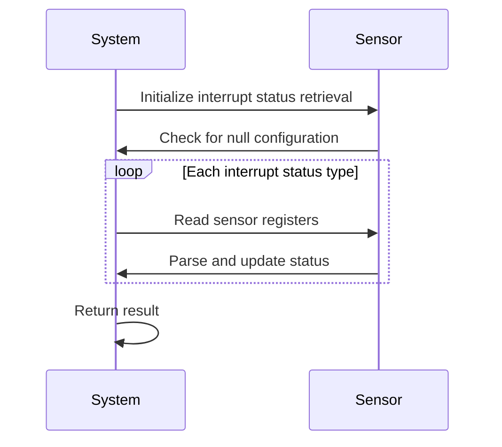
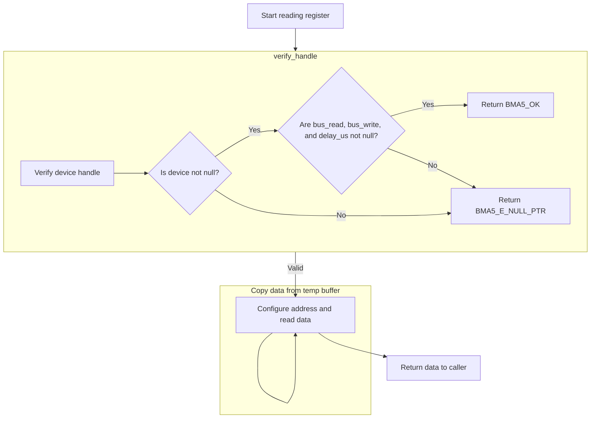
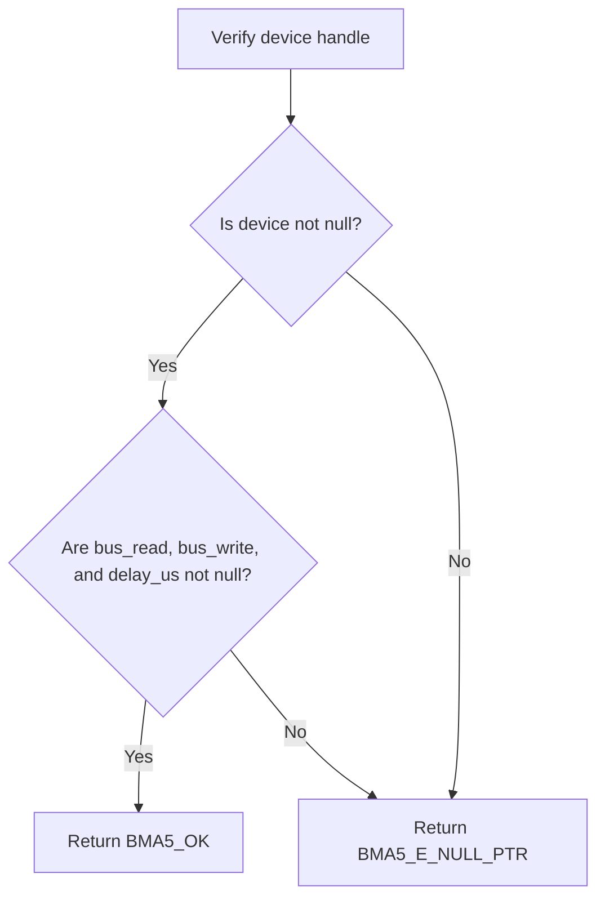
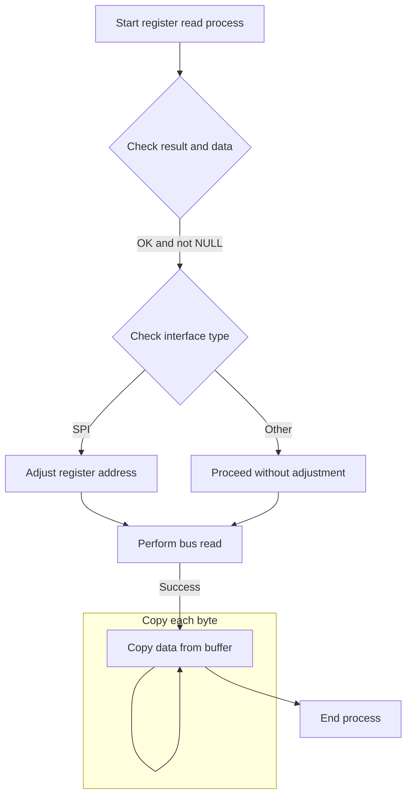

This document describes the process of retrieving and parsing interrupt statuses from the sensor. The flow involves initializing the retrieval process, checking for null configurations, iterating over each interrupt status type, reading sensor registers, parsing the statuses, and returning the result. For example, given a configuration with multiple interrupt sources, the flow reads the sensor registers and outputs the parsed statuses for each source.

The main steps are:

- Initialize interrupt status retrieval.
- Check for null configuration.
- Iterate over each interrupt status type.
- Read sensor registers for each interrupt source.
- Parse and update interrupt status.
- Return the result.



# Where is this flow used?

This flow is used multiple times in the codebase as represented in the following diagram:

(Note - these are only some of the entry points of this flow)

```mermaid
graph TD;
      subgraph bma530c["bma530.c"]
1fd2e3c74a3163cafc639074849be4d04593d25759b19cc50afe9c78dcbcaff5(get_fifo_full_16_bit_data) --> 3d8f2291c8b41b3770d5a230d19b545adabf48c982afb427e5576124b46e0f65(bma530_get_int_status):::mainFlowStyle
end

f3b03b5b0ce60b190adb5d7a9331325108ed76c178a7dcdb467af5353bfd68bb(main) --> 1fd2e3c74a3163cafc639074849be4d04593d25759b19cc50afe9c78dcbcaff5(get_fifo_full_16_bit_data)

subgraph bma530c["bma530.c"]
48131c6a37ed2530f3ba7afc870fab40b771246af87f173d2488dab9bebc2787(main) --> 3d8f2291c8b41b3770d5a230d19b545adabf48c982afb427e5576124b46e0f65(bma530_get_int_status):::mainFlowStyle
end

subgraph bma530c["bma530.c"]
0aad5d3b38a4158472193be3ac62349a3b58899d9336937add60cf2f04d2a408(main) --> 3d8f2291c8b41b3770d5a230d19b545adabf48c982afb427e5576124b46e0f65(bma530_get_int_status):::mainFlowStyle
end

subgraph bma530c["bma530.c"]
0e2e895a87858c61088bb7997202310bfc84563b7b53e81ea4cca658a00abb2a(main) --> 3d8f2291c8b41b3770d5a230d19b545adabf48c982afb427e5576124b46e0f65(bma530_get_int_status):::mainFlowStyle
end

subgraph bma530c["bma530.c"]
90397682c75b2db97937f55d6f54abbdc5345b77bd0a0a2a6301e9156f912c66(get_fifo_full_8_bit_data) --> 3d8f2291c8b41b3770d5a230d19b545adabf48c982afb427e5576124b46e0f65(bma530_get_int_status):::mainFlowStyle
end

995b7fc0fd14f2c4b3f5c5598f034967f07410e6b23421882a261c2a19d2ab69(main) --> 90397682c75b2db97937f55d6f54abbdc5345b77bd0a0a2a6301e9156f912c66(get_fifo_full_8_bit_data)

subgraph bma530c["bma530.c"]
59772c9027848a1d72dab24ae8becbe20fd3926606174d0b4a18e23501043c1c(main) --> 3d8f2291c8b41b3770d5a230d19b545adabf48c982afb427e5576124b46e0f65(bma530_get_int_status):::mainFlowStyle
end

subgraph bma530c["bma530.c"]
cc403b1810ce0a74a5616c13d964bb3e231d19a414192427644d3362d100f159(get_fifo_full_16_bit_data) --> 3d8f2291c8b41b3770d5a230d19b545adabf48c982afb427e5576124b46e0f65(bma530_get_int_status):::mainFlowStyle
end

9165887b073c46519c72eb2348bd335ecaa957754fefcab085e18349d280721c(main) --> cc403b1810ce0a74a5616c13d964bb3e231d19a414192427644d3362d100f159(get_fifo_full_16_bit_data)

subgraph bma530c["bma530.c"]
46ae92f8d393f42ded7493dde10353f8390e556cf1093b8ca301e34e1351a9a4(main) --> 3d8f2291c8b41b3770d5a230d19b545adabf48c982afb427e5576124b46e0f65(bma530_get_int_status):::mainFlowStyle
end

subgraph bma530c["bma530.c"]
7cdcb68f2f56667bb929b9d9abd3156a76cfc3ddfaca329820c014e6d7fb2748(get_fifo_full_8_bit_data) --> 3d8f2291c8b41b3770d5a230d19b545adabf48c982afb427e5576124b46e0f65(bma530_get_int_status):::mainFlowStyle
end

fbb53cb937ea3a377ab7aadaaa1b304db0fe38a00b82733ddfba5e5b3ae40a3e(main) --> 7cdcb68f2f56667bb929b9d9abd3156a76cfc3ddfaca329820c014e6d7fb2748(get_fifo_full_8_bit_data)

subgraph bma530c["bma530.c"]
756287b2d34025fea3661df0640382efe04cb8018ffacbaba2335f5900fe3e84(get_fifo_full_16_bit_data) --> 3d8f2291c8b41b3770d5a230d19b545adabf48c982afb427e5576124b46e0f65(bma530_get_int_status):::mainFlowStyle
end

56d52cc33914ea1bb5956c5e1ca305621b7321ab30121ab4af3fb4476cbd05d3(main) --> 756287b2d34025fea3661df0640382efe04cb8018ffacbaba2335f5900fe3e84(get_fifo_full_16_bit_data)

subgraph bma530c["bma530.c"]
053f55732dbeab723f5eb663e12fc8d39387757021b872d9cf36c111031badad(get_fifo_full_8_bit_data) --> 3d8f2291c8b41b3770d5a230d19b545adabf48c982afb427e5576124b46e0f65(bma530_get_int_status):::mainFlowStyle
end

3362b25ec0c2b32013f64a7b623085bd79d8523c7aa515aea5355343fa51db83(main) --> 053f55732dbeab723f5eb663e12fc8d39387757021b872d9cf36c111031badad(get_fifo_full_8_bit_data)

subgraph bma530c["bma530.c"]
5e4c4680254b0eeb8ede1ddfa09b0c86fbfe1f14e97b3c9a22fb5de564ec7f3e(get_fifo_full_8_bit_data) --> 3d8f2291c8b41b3770d5a230d19b545adabf48c982afb427e5576124b46e0f65(bma530_get_int_status):::mainFlowStyle
end

ce0c2a23d9ef661b3a0040e99cf9008811098a587b6f1a98f933e565d3861c84(main) --> 5e4c4680254b0eeb8ede1ddfa09b0c86fbfe1f14e97b3c9a22fb5de564ec7f3e(get_fifo_full_8_bit_data)

subgraph bma530c["bma530.c"]
0becd3ab3498d45b539a494ea1c350c1bf3fb6945e6e27c90d2d24fb4e8335d7(main) --> 3d8f2291c8b41b3770d5a230d19b545adabf48c982afb427e5576124b46e0f65(bma530_get_int_status):::mainFlowStyle
end

subgraph bma530c["bma530.c"]
244c4a8c0cdfc2fa9982162778a72d4d8320e07932f381c20ca6667ff8512388(get_fifo_full_16_bit_data) --> 3d8f2291c8b41b3770d5a230d19b545adabf48c982afb427e5576124b46e0f65(bma530_get_int_status):::mainFlowStyle
end

179c235479a1c867277f7d49a7d0c0bdc2f77cbb5fefaa8b40a09769673f5fb8(main) --> 244c4a8c0cdfc2fa9982162778a72d4d8320e07932f381c20ca6667ff8512388(get_fifo_full_16_bit_data)

subgraph bma530c["bma530.c"]
29e062a1160712a2c1dd1d628e4eb1f1ac3bdef5474ef04b06eb57a550a23dcf(main) --> 3d8f2291c8b41b3770d5a230d19b545adabf48c982afb427e5576124b46e0f65(bma530_get_int_status):::mainFlowStyle
end

subgraph bma530c["bma530.c"]
2950f860285d5e3d0398619015233f256d7ec6912dbd5a985661685f8ce9b7b8(main) --> 3d8f2291c8b41b3770d5a230d19b545adabf48c982afb427e5576124b46e0f65(bma530_get_int_status):::mainFlowStyle
end

subgraph bma530c["bma530.c"]
338846f575b020e04ca1d838e1f66b0bf1f62d299dcd118e594875432ec7050a(main) --> 3d8f2291c8b41b3770d5a230d19b545adabf48c982afb427e5576124b46e0f65(bma530_get_int_status):::mainFlowStyle
end

subgraph bma530c["bma530.c"]
eaf1496cf0aafe0668e313eeb92d888714cc99e11321c02ca1f937eb0bb69389(main) --> 3d8f2291c8b41b3770d5a230d19b545adabf48c982afb427e5576124b46e0f65(bma530_get_int_status):::mainFlowStyle
end

subgraph bma530c["bma530.c"]
f65097ae9b8781965e56cfc037158110ff6a331d62423382215c3c4a6c7731fc(main) --> 3d8f2291c8b41b3770d5a230d19b545adabf48c982afb427e5576124b46e0f65(bma530_get_int_status):::mainFlowStyle
end

subgraph bma530c["bma530.c"]
8968386807917c2cb1c2e757c1de116aa4ae4dc9e22e69687b29754bd0f4a504(main) --> 3d8f2291c8b41b3770d5a230d19b545adabf48c982afb427e5576124b46e0f65(bma530_get_int_status):::mainFlowStyle
end

subgraph bma530c["bma530.c"]
eac407335a5f3fd24a35b6015bd470a16e747916338364a23cb6ced2157f3866(main) --> 3d8f2291c8b41b3770d5a230d19b545adabf48c982afb427e5576124b46e0f65(bma530_get_int_status):::mainFlowStyle
end

subgraph bma530c["bma530.c"]
42a4b62e5c27a0fe8f4df2994f3b43afad4b66a1a7c1c8d6d706b5da9962a601(main) --> 3d8f2291c8b41b3770d5a230d19b545adabf48c982afb427e5576124b46e0f65(bma530_get_int_status):::mainFlowStyle
end

subgraph bma530c["bma530.c"]
f894b5e18a059cca47740258fd05a0744e5bb969c4c11c899544ad219cbb89af(main) --> 3d8f2291c8b41b3770d5a230d19b545adabf48c982afb427e5576124b46e0f65(bma530_get_int_status):::mainFlowStyle
end

subgraph bma530c["bma530.c"]
01fac58f3eb89b4ef712df88848b4d385ab23294845310150918c72eae572fe6(main) --> 3d8f2291c8b41b3770d5a230d19b545adabf48c982afb427e5576124b46e0f65(bma530_get_int_status):::mainFlowStyle
end


classDef mainFlowStyle color:#000000,fill:#7CB9F4
classDef rootsStyle color:#000000,fill:#00FFF4
classDef Style1 color:#000000,fill:#00FFAA
classDef Style2 color:#000000,fill:#FFFF00
classDef Style3 color:#000000,fill:#AA7CB9
```



# Initializing Interrupt Status Retrieval

```mermaid
flowchart TD
    node1[Start processing interrupt statuses] --> node2{Is config null?}
    node2 -->|No| node3[Iterate over each interrupt status type]

    subgraph loop1[For each interrupt status type]
        node3 --> node4{Check interrupt source type}
        node4 -->|INT1| node5[Reading Sensor Registers]
        node4 -->|INT2| node6[Reading Sensor Registers]
        node4 -->|I3C| node7[Reading Sensor Registers]
        node4 -->|Invalid| node8[Set error status]
        node5 --> node9[Parse and update status]
        node6 --> node9
        node7 --> node9
        node8 --> node9
        node9 --> node3
    end

    node3 --> node10[Return result]

subgraph node5 [bma5_get_regs]
  sgmain_1_node1[Start reading register] --> sgmain_1_node2{Verify device handle}
  sgmain_1_node2 -->|Valid| sgmain_1_node3[Configure address and read data]
  subgraph loop1[Copy data from temp buffer]
  sgmain_1_node3 --> sgmain_1_node3
  end
  sgmain_1_node3 --> sgmain_1_node4[Return data to caller]
end
```

<SwmSnippet path="/bma530.c" line="72" repo-id="Z2l0aHViJTNBJTNBQk1BNTMwX1NlbnNvckFQSSUzQSUzQVNoYW50YW51TWFuZHBlLUJvc2No">

---

We start the flow by initializing the interrupt status retrieval process, checking for null pointers, and looping through the configuration to identify interrupt sources. We call bma5_get_regs next to fetch the register values that correspond to each interrupt source, which is essential for interpreting the interrupt statuses.

```c
int8_t bma530_get_int_status(struct bma530_int_status_types *config, uint8_t n_status, struct bma5_dev *dev)
{
    /* Function execution status */
    int8_t result = BMA5_OK;
    uint8_t loop;

    /* Temporary variable to carry the register value */
    uint8_t reg_value[2] = { 0 };

    if (NULL == config)
    {
        result = BMA5_E_NULL_PTR;
    }
    else
    {
        for (loop = 0; loop < n_status; loop++)
        {
            switch (config[loop].int_src)
            {
                case BMA530_INT_STATUS_INT1:
                    result = bma5_get_regs(BMA530_REG_INT_STATUS_INT1_0, reg_value, 2, dev);
                    break;

```

---

</SwmSnippet>

## Reading Sensor Registers



<SwmSnippet path="/bma5.c" line="1333" repo-id="Z2l0aHViJTNBJTNBQk1BNTMwX1NlbnNvckFQSSUzQSUzQVNoYW50YW51TWFuZHBlLUJvc2No">

---

Here, we implement the function to read sensor register data. We call verify_handle next to confirm that the device is properly initialized and capable of communication, which is essential for reading the register data accurately.

```c
 * @brief This API reads the data from the given register address of bma5
 *        sensor.
 */
int8_t bma5_get_regs(uint8_t addr, uint8_t *data, uint32_t len, struct bma5_dev *dev)
{
    /* Function execution status */
    int8_t result;

    /* Temporary buffer to receive the serial data from sensor */
    uint8_t temp_buf[BMA5_MAX_BUFFER_SIZE] = { 0 };

    /* Number of bytes to be copied from temp_buf to data */
    uint32_t bytes_to_copy = len;

    result = verify_handle(dev);
```

---

</SwmSnippet>

### Validating Device Handle



<SwmSnippet path="/bma5.c" line="1698" repo-id="Z2l0aHViJTNBJTNBQk1BNTMwX1NlbnNvckFQSSUzQSUzQVNoYW50YW51TWFuZHBlLUJvc2No">

---

The verify_handle function returns BMA5_OK if the device handle and its functions are valid, ensuring the device is ready for operations. Otherwise, it returns an error code.

```c
/*********************** Static function definitions **************************/
/******************************************************************************/
static int8_t verify_handle(const struct bma5_dev *dev)
{
    /* Function execution status */
    int8_t result = BMA5_E_NULL_PTR;

    if (NULL != dev)
    {
        if ((NULL != dev->bus_read) && (NULL != dev->bus_write) && (NULL != dev->delay_us))
        {
            result = BMA5_OK;
        }
    }

    return result;
}
```

---

</SwmSnippet>

### Handling Register Read Logic



<SwmSnippet path="/bma5.c" line="1348" repo-id="Z2l0aHViJTNBJTNBQk1BNTMwX1NlbnNvckFQSSUzQSUzQVNoYW50YW51TWFuZHBlLUJvc2No">

---

Back in bma5_get_regs, after verify_handle, we check the data pointer, configure the SPI register address, and perform the read operation using bus_read, which is essential for retrieving data from the sensor's registers.

```c
    if ((BMA5_OK == result) && (NULL == data))
    {
        result = BMA5_E_NULL_PTR;
    }

    if (BMA5_OK == result)
    {
        /* Configuring register address for SPI Interface */
        if (BMA5_SPI_INTF == dev->intf)
        {
            addr = addr | BMA5_SPI_RD_MSK;
        }

        dev->intf_rslt = dev->bus_read(addr, temp_buf, (len + dev->dummy_byte), dev->intf_ptr);

        if (BMA5_INTF_RET_SUCCESS != dev->intf_rslt)
        {
            result = BMA5_E_COM_FAIL;
        }
    }

    if (BMA5_OK == result)
    {
        while (bytes_to_copy--)
        {
            data[bytes_to_copy] = temp_buf[bytes_to_copy + dev->dummy_byte];
        }
```

---

</SwmSnippet>

## Processing Interrupt Source INT2

<SwmSnippet path="/bma530.c" line="95" repo-id="Z2l0aHViJTNBJTNBQk1BNTMwX1NlbnNvckFQSSUzQSUzQVNoYW50YW51TWFuZHBlLUJvc2No">

---

Back in bma530_get_int_status, after bma5_get_regs, we process INT2 by checking the result and parsing the interrupt status. We call bma5_get_regs next for each interrupt source to ensure all statuses are handled.

```c
                case BMA530_INT_STATUS_INT2:
                    result = bma5_get_regs(BMA530_REG_INT_STATUS_INT2_0, reg_value, 2, dev);
                    break;

```

---

</SwmSnippet>

## Processing Interrupt Source I3C

<SwmSnippet path="/bma530.c" line="99" repo-id="Z2l0aHViJTNBJTNBQk1BNTMwX1NlbnNvckFQSSUzQSUzQVNoYW50YW51TWFuZHBlLUJvc2No">

---

Back in bma530_get_int_status, after bma5_get_regs, we process I3C by checking the result and parsing the interrupt status. We call bma5_get_regs next for each interrupt source to ensure all statuses are handled.

```c
                case BMA530_INT_STATUS_I3C:
                    result = bma5_get_regs(BMA530_REG_INT_STATUS_I3C_0, reg_value, 2, dev);
                    break;

```

---

</SwmSnippet>

## Finalizing Interrupt Status Parsing

<SwmSnippet path="/bma530.c" line="103" repo-id="Z2l0aHViJTNBJTNBQk1BNTMwX1NlbnNvckFQSSUzQSUzQVNoYW50YW51TWFuZHBlLUJvc2No">

---

Finally, in bma530_get_int_status, after bma5_get_regs, we finalize parsing by checking the result, extracting interrupt statuses, and updating the configuration to consolidate the data into a usable format.

```c
                default:
                    result = BMA5_E_INVALID_INT_STATUS;
                    break;
            }

            if (BMA5_OK != result)
            {
                break;
            }

            /* Parse needed details from received serial data */
            config[loop].int_status.acc_drdy_int_status = BMA5_GET_BITS_POS_0(reg_value[0], BMA530_ACC_DRDY_INT_STATUS);
            config[loop].int_status.fifo_wm_int_status = BMA5_GET_BITS(reg_value[0], BMA530_FIFO_WM_INT_STATUS);
            config[loop].int_status.fifo_full_int_status = BMA5_GET_BITS(reg_value[0], BMA530_FIFO_FULL_INT_STATUS);
            config[loop].int_status.gen_int1_int_status = BMA5_GET_BITS(reg_value[0], BMA530_GEN_INT1_INT_STATUS);
            config[loop].int_status.gen_int2_int_status = BMA5_GET_BITS(reg_value[0], BMA530_GEN_INT2_INT_STATUS);
            config[loop].int_status.gen_int3_int_status = BMA5_GET_BITS(reg_value[0], BMA530_GEN_INT3_INT_STATUS);
            config[loop].int_status.step_det_int_status = BMA5_GET_BITS(reg_value[0], BMA530_STEP_DET_INT_STATUS);
            config[loop].int_status.step_cnt_int_status = BMA5_GET_BITS(reg_value[0], BMA530_STEP_CNT_INT_STATUS);

            config[loop].int_status.sig_mo_int_status = BMA5_GET_BITS_POS_0(reg_value[1], BMA530_SIG_MO_INT_STATUS);
            config[loop].int_status.tilt_int_status = BMA5_GET_BITS(reg_value[1], BMA530_TILT_INT_STATUS);
            config[loop].int_status.orient_int_status = BMA5_GET_BITS(reg_value[1], BMA530_ORIENT_INT_STATUS);
            config[loop].int_status.acc_foc_int_status = BMA5_GET_BITS(reg_value[1], BMA530_ACC_FOC_INT_STATUS);
            config[loop].int_status.feat_eng_err_int_status =
                BMA5_GET_BITS(reg_value[1], BMA530_FEAT_ENG_ERR_INT_STATUS);
        }
    }

    return result;
}
```

---

</SwmSnippet>

&nbsp;

*This is an auto-generated document by Swimm 🌊 and has not yet been verified by a human*

<SwmMeta version="3.0.0"><sup>Powered by [Swimm](https://staging.swimm.cloud/)</sup></SwmMeta>
