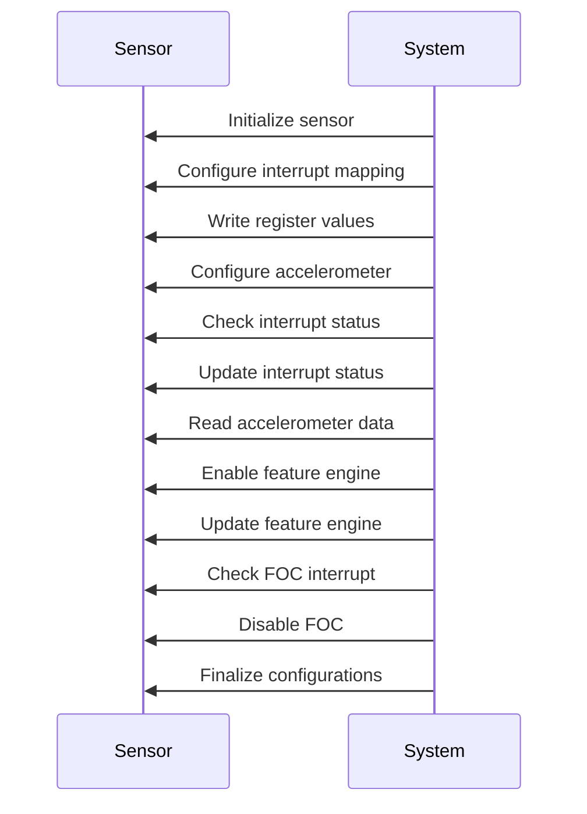
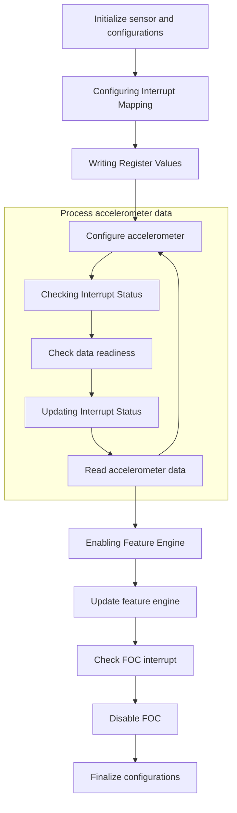
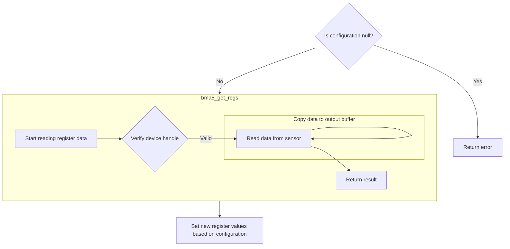
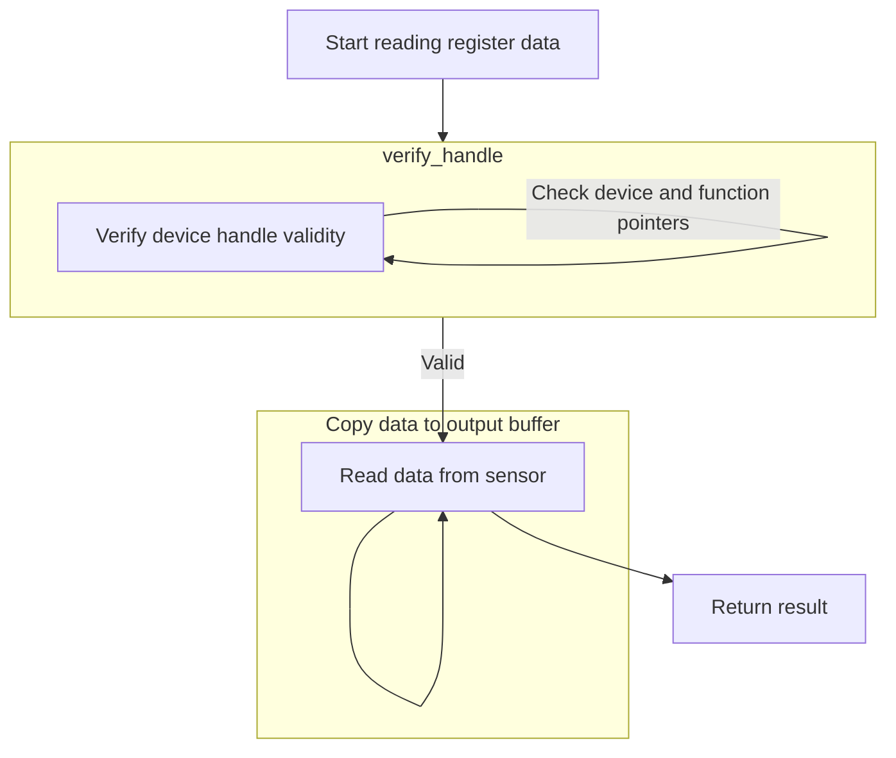
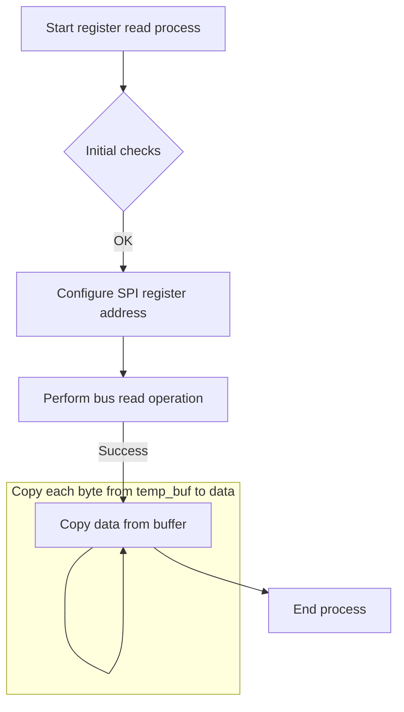
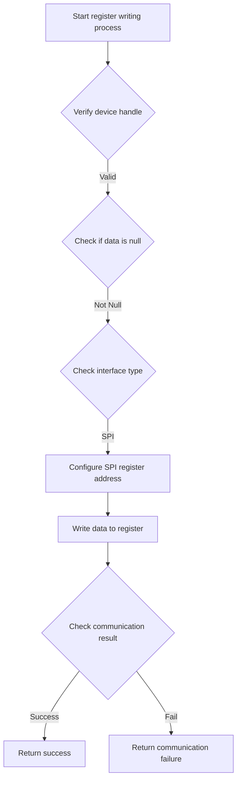
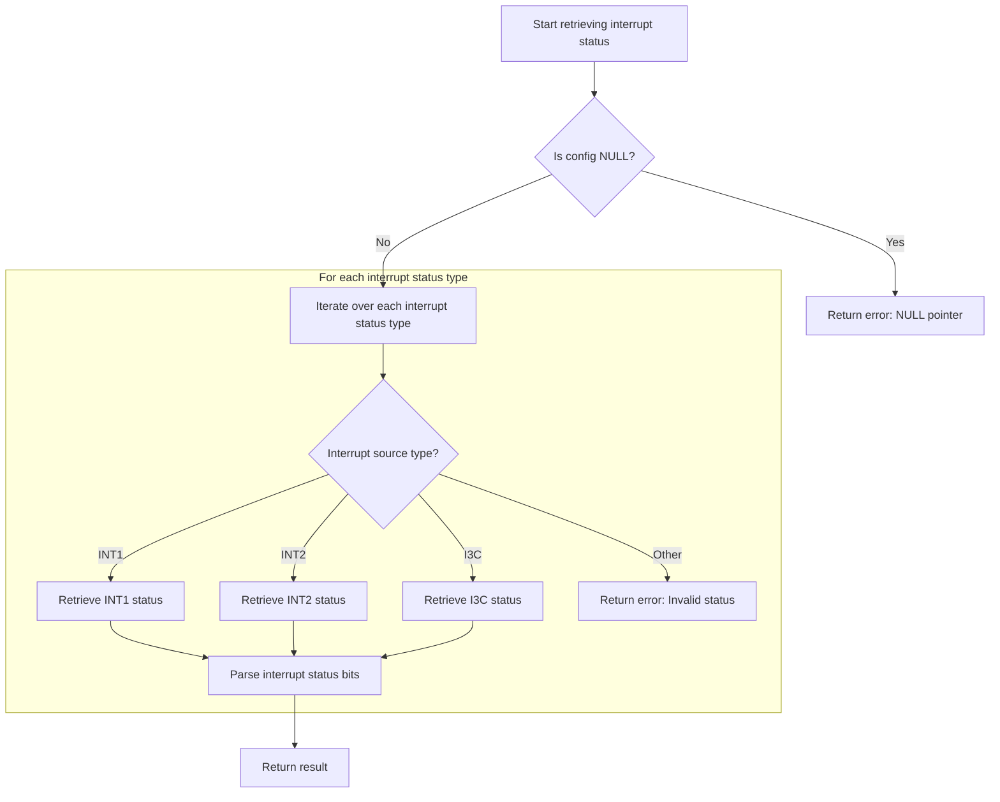
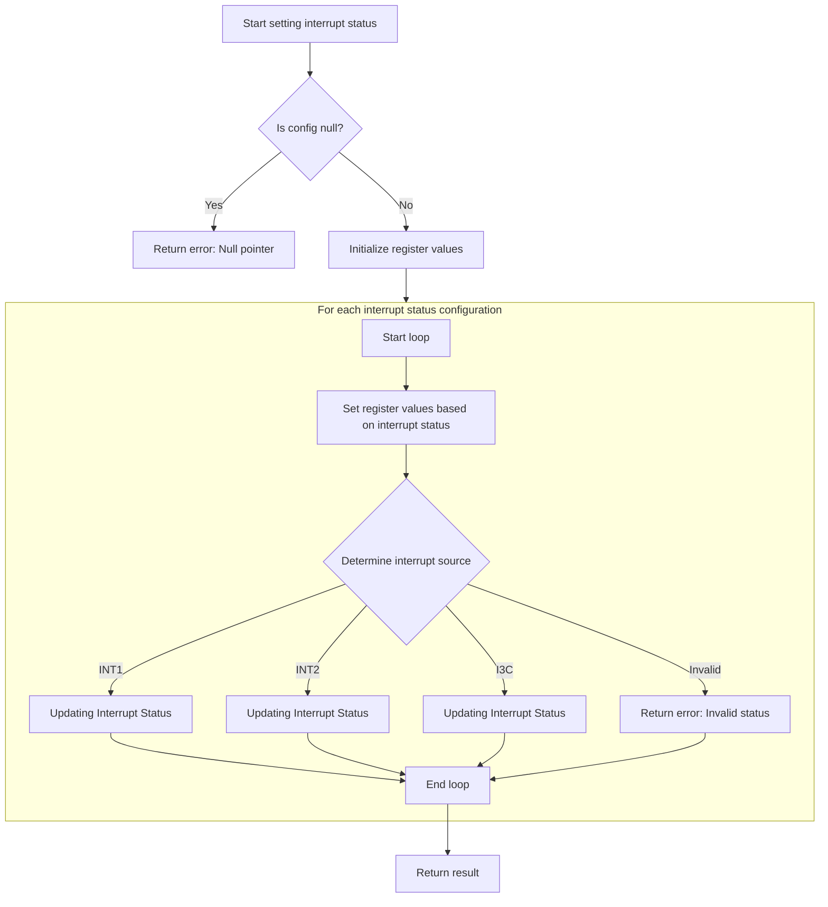
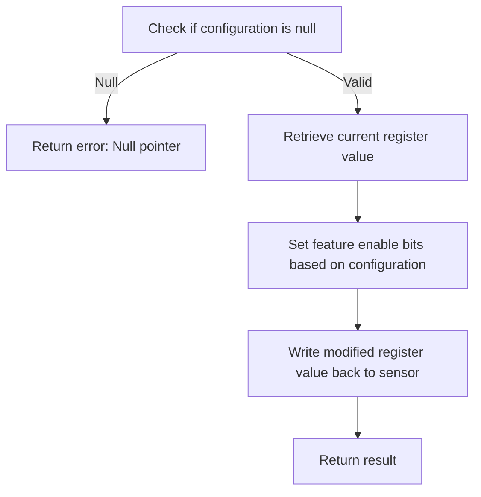

The document outlines the process of initializing and configuring the sensor to ensure it is ready for accurate data processing. This involves initializing the sensor, configuring interrupt mapping, writing register values, setting accelerometer configurations, checking and updating interrupt status, reading accelerometer data, enabling and updating the feature engine, checking FOC interrupt, and finalizing configurations.



# Initializing and Configuring the Sensor



<SwmSnippet path="/examples/accel_foc/accel_foc.c" line="62" repo-id="Z2l0aHViJTNBJTNBQk1BNTMwX1NlbnNvckFQSSUzQSUzQVNoYW50YW51TWFuZHBlLUJvc2No">

---

First, the main function initializes the sensor and sets up configurations, including interrupt mapping. We need to call bma530_set_int_map next to ensure interrupts are correctly routed to hardware pins, enabling effective sensor communication.

```c
int main(void)
{
    int8_t rslt;
    uint8_t n_ints = 2;
    uint8_t n_status = 2;
    uint8_t loop;
    uint8_t limit = 10;
    uint8_t sensor_ctrl;
    float x, y, z;

    /*Structue to hold the configurations */
    struct bma5_dev dev;
    struct bma5_acc_conf config;
    struct bma530_int_map int_map = { 0 };
    struct bma530_int_status_types int_status[2];
    struct bma5_int_conf_types int_config[2];
    struct bma530_accel_foc_config conf;
    struct bma530_feat_eng_gpr_0 gpr_0;
    struct bma530_feat_eng_gp_flags gp_flags;
    struct bma5_accel_doff user_off;
    struct bma5_sensor_status status;
    struct bma5_accel sens_data = { 0 };
    struct bma5_feat_eng_gpr_ctrl gpr_ctrl_host;

    /* Assign context parameter selection */
    enum bma5_context context;

    context = BMA5_SMARTPHONE;

    /*Mapping to hardware interrupt pin 1 and 2 on sensor */
    int_config[0].int_src = BMA5_INT_1;
    int_config[1].int_src = BMA5_INT_2;

    /* Variable to hold configurations related to interrupt pin */
    int_status[0].int_src = BMA530_INT_STATUS_INT1;
    int_status[1].int_src = BMA530_INT_STATUS_INT2;

    /* Interface reference is given as a parameter
     *         For I2C : BMA5_I2C_INTF
     *         For SPI : BMA5_SPI_INTF
     */
    rslt = bma5_interface_init(&dev, BMA5_SPI_INTF, context);
    bma5_check_rslt("bma5_interface_init", rslt);

    /* Initialize the BMA5 device instance */
    rslt = bma530_init(&dev);
    bma5_check_rslt("bma530_init", rslt);
    printf("Chip ID:0x%x\n\n", dev.chip_id);

    /* Get accel configurations */
    rslt = bma5_get_acc_conf_0(&sensor_ctrl, &dev);
    bma5_check_rslt("bma5_get_acc_conf_0", rslt);

    sensor_ctrl = BMA5_SENSOR_CTRL_DISABLE;

    /* disable accel */
    rslt = bma5_set_acc_conf_0(sensor_ctrl, &dev);
    bma5_check_rslt("bma5_get_acc_conf_0", rslt);

    /* Get accel configurations */
    rslt = bma5_get_acc_conf_0(&sensor_ctrl, &dev);
    bma5_check_rslt("bma5_get_acc_conf_0", rslt);

    /* Map generic interrupts to hardware interrupt pin of the sensor */
    rslt = bma530_get_int_map(&int_map, &dev);
    bma5_check_rslt("bma530_get_int_map", rslt);

    /* Map accel drdy interrupt */
    int_map.acc_drdy_int_map = BMA530_ACC_DRDY_INT_MAP_INT1;

    /* Map accel foc interrupt */
    int_map.acc_foc_int_map = BMA530_ACC_FOC_INT_MAP_INT2;

    /* Set the interrupt map */
    rslt = bma530_set_int_map(&int_map, &dev);
```

---

</SwmSnippet>

## Configuring Interrupt Mapping



<SwmSnippet path="/bma530.c" line="261" repo-id="Z2l0aHViJTNBJTNBQk1BNTMwX1NlbnNvckFQSSUzQSUzQVNoYW50YW51TWFuZHBlLUJvc2No">

---

Here, we prepare interrupt mapping configurations. We call bma5_get_regs next to retrieve current register values, ensuring that modifications are based on the most recent data, preventing configuration errors.

```c
int8_t bma530_set_int_map(const struct bma530_int_map *config, struct bma5_dev *dev)
{
    /* Function execution status */
    int8_t result;

    /* Temporary variable to store the register value to be set */
    uint8_t reg_value[4] = { 0 };

    uint8_t acc_drdy_int_map, fifo_wm_int_map, fifo_full_int_map, gen_int1_int_map;
    uint8_t gen_int2_int_map, gen_int3_int_map, step_det_int_map, step_cnt_int_map;
    uint8_t sig_mo_int_map, tilt_int_map, orient_int_map, acc_foc_int_map;

    if (NULL == config)
    {
        result = BMA5_E_NULL_PTR;
    }
    else
    {
        result = bma5_get_regs(BMA530_REG_INT_MAP_0, reg_value, 4, dev);

```

---

</SwmSnippet>

### Reading Register Values



<SwmSnippet path="/bma5.c" line="1333" repo-id="Z2l0aHViJTNBJTNBQk1BNTMwX1NlbnNvckFQSSUzQSUzQVNoYW50YW51TWFuZHBlLUJvc2No">

---

First, bma5_get_regs reads data from sensor registers. We call verify_handle next to ensure the device is properly initialized and valid, preventing communication errors.

```c
 * @brief This API reads the data from the given register address of bma5
 *        sensor.
 */
int8_t bma5_get_regs(uint8_t addr, uint8_t *data, uint32_t len, struct bma5_dev *dev)
{
    /* Function execution status */
    int8_t result;

    /* Temporary buffer to receive the serial data from sensor */
    uint8_t temp_buf[BMA5_MAX_BUFFER_SIZE] = { 0 };

    /* Number of bytes to be copied from temp_buf to data */
    uint32_t bytes_to_copy = len;

    result = verify_handle(dev);
```

---

</SwmSnippet>

#### Validating Device Handle

<SwmSnippet path="/bma5.c" line="1698" repo-id="Z2l0aHViJTNBJTNBQk1BNTMwX1NlbnNvckFQSSUzQSUzQVNoYW50YW51TWFuZHBlLUJvc2No">

---

Returns BMA5_OK if the device structure is valid, ensuring safe operations; otherwise, returns BMA5_E_NULL_PTR for an invalid structure.

```c
/*********************** Static function definitions **************************/
/******************************************************************************/
static int8_t verify_handle(const struct bma5_dev *dev)
{
    /* Function execution status */
    int8_t result = BMA5_E_NULL_PTR;

    if (NULL != dev)
    {
        if ((NULL != dev->bus_read) && (NULL != dev->bus_write) && (NULL != dev->delay_us))
        {
            result = BMA5_OK;
        }
    }

    return result;
}
```

---

</SwmSnippet>

#### Executing Register Read



<SwmSnippet path="/bma5.c" line="1348" repo-id="Z2l0aHViJTNBJTNBQk1BNTMwX1NlbnNvckFQSSUzQSUzQVNoYW50YW51TWFuZHBlLUJvc2No">

---

Back in bma5_get_regs, after verify_handle confirms a valid device, it checks for a null data pointer, configures the SPI register address, and performs the bus read operation, ensuring error-free communication.

```c
    if ((BMA5_OK == result) && (NULL == data))
    {
        result = BMA5_E_NULL_PTR;
    }

    if (BMA5_OK == result)
    {
        /* Configuring register address for SPI Interface */
        if (BMA5_SPI_INTF == dev->intf)
        {
            addr = addr | BMA5_SPI_RD_MSK;
        }

        dev->intf_rslt = dev->bus_read(addr, temp_buf, (len + dev->dummy_byte), dev->intf_ptr);

        if (BMA5_INTF_RET_SUCCESS != dev->intf_rslt)
        {
            result = BMA5_E_COM_FAIL;
        }
    }

    if (BMA5_OK == result)
    {
        while (bytes_to_copy--)
        {
            data[bytes_to_copy] = temp_buf[bytes_to_copy + dev->dummy_byte];
        }
```

---

</SwmSnippet>

### Updating Interrupt Registers

<SwmSnippet path="/bma530.c" line="281" repo-id="Z2l0aHViJTNBJTNBQk1BNTMwX1NlbnNvckFQSSUzQSUzQVNoYW50YW51TWFuZHBlLUJvc2No">

---

Back in bma530_set_int_map, after bma5_get_regs, it updates interrupt register values using macros and calls bma5_set_regs to apply new configurations to the sensor, enabling specified interrupt generation.

```c
        if (BMA5_OK == result)
        {
            /* Bring up the register value to be set, as per the input details */
            acc_drdy_int_map =
                (BMA5_SET_BITS_POS_0(reg_value[0], BMA530_ACC_DRDY_INT_MAP,
                                     config->acc_drdy_int_map) & BMA530_ACC_DRDY_INT_MAP_MSK);
            fifo_wm_int_map =
                (BMA5_SET_BITS(reg_value[0], BMA530_FIFO_WM_INT_MAP,
                               config->fifo_wm_int_map) & BMA530_FIFO_WM_INT_MAP_MSK);
            fifo_full_int_map =
                (BMA5_SET_BITS(reg_value[0], BMA530_FIFO_FULL_INT_MAP,
                               config->fifo_full_int_map) & BMA530_FIFO_FULL_INT_MAP_MSK);
            gen_int1_int_map =
                (BMA5_SET_BITS(reg_value[0], BMA530_GEN_INT1_INT_MAP,
                               config->gen_int1_int_map) & BMA530_GEN_INT1_INT_MAP_MSK);

            reg_value[0] = (uint8_t)(acc_drdy_int_map | fifo_wm_int_map | fifo_full_int_map | gen_int1_int_map);

            gen_int2_int_map =
                (BMA5_SET_BITS_POS_0(reg_value[1], BMA530_GEN_INT2_INT_MAP,
                                     config->gen_int2_int_map) & BMA530_GEN_INT2_INT_MAP_MSK);
            gen_int3_int_map =
                (BMA5_SET_BITS(reg_value[1], BMA530_GEN_INT3_INT_MAP,
                               config->gen_int3_int_map) & BMA530_GEN_INT3_INT_MAP_MSK);
            step_det_int_map =
                (BMA5_SET_BITS(reg_value[1], BMA530_STEP_DET_INT_MAP,
                               config->step_det_int_map) & BMA530_STEP_DET_INT_MAP_MSK);
            step_cnt_int_map =
                (BMA5_SET_BITS(reg_value[1], BMA530_STEP_CNT_INT_MAP,
                               config->step_cnt_int_map) & BMA530_STEP_CNT_INT_MAP_MSK);

            reg_value[1] = (uint8_t)(gen_int2_int_map | gen_int3_int_map | step_det_int_map | step_cnt_int_map);

            sig_mo_int_map =
                (BMA5_SET_BITS_POS_0(reg_value[2], BMA530_SIG_MO_INT_MAP,
                                     config->sig_mo_int_map) & BMA530_SIG_MO_INT_MAP_MSK);
            tilt_int_map =
                (BMA5_SET_BITS(reg_value[2], BMA530_TILT_INT_MAP, config->tilt_int_map) & BMA530_TILT_INT_MAP_MSK);
            orient_int_map =
                (BMA5_SET_BITS(reg_value[2], BMA530_ORIENT_INT_MAP,
                               config->orient_int_map) & BMA530_ORIENT_INT_MAP_MSK);
            acc_foc_int_map =
                (BMA5_SET_BITS(reg_value[2], BMA530_ACC_FOC_INT_MAP,
                               config->acc_foc_int_map) & BMA530_ACC_FOC_INT_MAP_MSK);

            reg_value[2] = (uint8_t)(sig_mo_int_map | tilt_int_map | orient_int_map | acc_foc_int_map);

            reg_value[3] = BMA5_SET_BITS_POS_0(reg_value[3], BMA530_FEAT_ENG_ERR_INT_MAP, config->feat_eng_err_int_map);

            result = bma5_set_regs(BMA530_REG_INT_MAP_0, reg_value, 4, dev);
        }
    }

    return result;
}
```

---

</SwmSnippet>

## Writing Register Values



<SwmSnippet path="/bma5.c" line="1381" repo-id="Z2l0aHViJTNBJTNBQk1BNTMwX1NlbnNvckFQSSUzQSUzQVNoYW50YW51TWFuZHBlLUJvc2No">

---

First, bma5_set_regs writes data to sensor registers. We call verify_handle next to ensure the device is properly initialized and valid, preventing communication errors.

```c
 * @brief This API writes data to the given register address of bma5 sensor.
 */
int8_t bma5_set_regs(uint8_t addr, const uint8_t *data, uint32_t len, struct bma5_dev *dev)
{
    /* Function execution status */
    int8_t result;

    result = verify_handle(dev);
```

---

</SwmSnippet>

<SwmSnippet path="/bma5.c" line="1389" repo-id="Z2l0aHViJTNBJTNBQk1BNTMwX1NlbnNvckFQSSUzQSUzQVNoYW50YW51TWFuZHBlLUJvc2No">

---

Back in bma5_set_regs, after verify_handle confirms a valid device, it checks for a null data pointer, configures the SPI register address, and performs the bus write operation, ensuring error-free communication.

```c
    if ((BMA5_OK == result) && (NULL == data))
    {
        result = BMA5_E_NULL_PTR;
    }

    if (BMA5_OK == result)
    {
        /* Configuring register address for SPI Interface */
        if (BMA5_SPI_INTF == dev->intf)
        {
            addr = (addr & BMA5_SPI_WR_MSK);
        }

        dev->intf_rslt = dev->bus_write(addr, data, len, dev->intf_ptr);

        if (BMA5_INTF_RET_SUCCESS != dev->intf_rslt)
        {
            result = BMA5_E_COM_FAIL;
        }
    }

    return result;
}
```

---

</SwmSnippet>

## Configuring Accelerometer Settings

<SwmSnippet path="/examples/accel_foc/accel_foc.c" line="137" repo-id="Z2l0aHViJTNBJTNBQk1BNTMwX1NlbnNvckFQSSUzQSUzQVNoYW50YW51TWFuZHBlLUJvc2No">

---

Back in main, after bma530_set_int_map, it configures accelerometer settings and hardware interrupt pins. Calling bma530_get_int_status next checks interrupt status, verifying that configurations are functioning as expected.

```c
    bma5_check_rslt("bma530_set_int_map_0", rslt);

    /* Get accel configurations */
    rslt = bma5_get_acc_conf(&config, &dev);
    bma5_check_rslt("bma5_get_acc_conf", rslt);

    /* Set the accel configurations */
    sensor_ctrl = BMA5_SENSOR_CTRL_ENABLE;
    config.acc_odr = BMA5_ACC_ODR_HZ_50;
    config.acc_range = BMA5_ACC_RANGE_MAX_16G;

    /* enable accel */
    rslt = bma5_set_acc_conf_0(sensor_ctrl, &dev);
    bma5_check_rslt("bma5_set_acc_conf_0", rslt);

    /* Set the accel configurations */
    rslt = bma5_set_acc_conf(&config, &dev);
    bma5_check_rslt("bma5_get_acc_conf", rslt);

    printf("\nAccel configurations\n");
    printf("ODR : %s\t\n", enum_to_string(BMA5_ACC_ODR_HZ_50));
    printf("Range : %s\t\n", enum_to_string(BMA5_ACC_RANGE_MAX_16G));

    /* Map hardware interrupt pin configurations */
    rslt = bma5_get_int_conf(int_config, n_ints, &dev);
    bma5_check_rslt("bma5_get_int_conf", rslt);

    /* Set the hardware interrupt pin configuration */
    int_config[0].int_conf.int_mode = BMA5_INT1_MODE_PULSED_LONG;
    int_config[0].int_conf.int_od = BMA5_INT1_OD_PUSH_PULL;
    int_config[0].int_conf.int_lvl = BMA5_INT1_LVL_ACTIVE_HIGH;

    int_config[1].int_conf.int_mode = BMA5_INT2_MODE_PULSED_LONG;
    int_config[1].int_conf.int_od = BMA5_INT2_OD_PUSH_PULL;
    int_config[1].int_conf.int_lvl = BMA5_INT2_LVL_ACTIVE_HIGH;

    rslt = bma5_set_int_conf(int_config, n_ints, &dev);
    bma5_check_rslt("bma5_set_int_conf", rslt);

    printf("\nInt1 mode : %s\t\n", enum_to_string(BMA5_INT1_MODE_PULSED_LONG));
    printf("Int1 output type : %s\t\n", enum_to_string(BMA5_INT1_OD_PUSH_PULL));
    printf("Int1 level : %s\t\n", enum_to_string(BMA5_INT1_LVL_ACTIVE_HIGH));

    printf("\nInt2 mode : %s\t\n", enum_to_string(BMA5_INT2_MODE_PULSED_LONG));
    printf("Int2 output type : %s\t\n", enum_to_string(BMA5_INT2_OD_PUSH_PULL));
    printf("Int2 level : %s\t\n", enum_to_string(BMA5_INT2_LVL_ACTIVE_HIGH));

    printf("\nIteration count : %d\n\n", limit);
    printf("Reading Accel values before FOC compensation\n");
    printf("\n# Count, Accel_LSB_X, Accel_LSB_Y, Accel_LSB_Z, Acc_ms2_X, Acc_ms2_Y, Acc_ms2_Z\n");

    loop = 0;
    while (loop < limit)
    {
        for (;;)
        {
            /* Get accel data ready status */
            rslt = bma5_get_sensor_status(&status, &dev);
            bma5_check_rslt("bma5_get_sensor_status", rslt);

            if (status.acc_data_rdy)
            {
                /* Get accel data ready interrupt status */
                rslt = bma530_get_int_status(int_status, n_status, &dev);
```

---

</SwmSnippet>

## Checking Interrupt Status



<SwmSnippet path="/bma530.c" line="72" repo-id="Z2l0aHViJTNBJTNBQk1BNTMwX1NlbnNvckFQSSUzQSUzQVNoYW50YW51TWFuZHBlLUJvc2No">

---

Here, it checks interrupt status by initializing variables and looping through sources. Calling bma5_get_regs next reads interrupt status registers, providing data for accurate reporting.

```c
int8_t bma530_get_int_status(struct bma530_int_status_types *config, uint8_t n_status, struct bma5_dev *dev)
{
    /* Function execution status */
    int8_t result = BMA5_OK;
    uint8_t loop;

    /* Temporary variable to carry the register value */
    uint8_t reg_value[2] = { 0 };

    if (NULL == config)
    {
        result = BMA5_E_NULL_PTR;
    }
    else
    {
        for (loop = 0; loop < n_status; loop++)
        {
            switch (config[loop].int_src)
            {
                case BMA530_INT_STATUS_INT1:
                    result = bma5_get_regs(BMA530_REG_INT_STATUS_INT1_0, reg_value, 2, dev);
                    break;

```

---

</SwmSnippet>

<SwmSnippet path="/bma530.c" line="95" repo-id="Z2l0aHViJTNBJTNBQk1BNTMwX1NlbnNvckFQSSUzQSUzQVNoYW50YW51TWFuZHBlLUJvc2No">

---

Back in bma530_get_int_status, after bma5_get_regs, it uses a switch to handle sources, calling bma5_get_regs again for each to ensure accurate capture of all interrupt statuses.

```c
                case BMA530_INT_STATUS_INT2:
                    result = bma5_get_regs(BMA530_REG_INT_STATUS_INT2_0, reg_value, 2, dev);
                    break;

```

---

</SwmSnippet>

<SwmSnippet path="/bma530.c" line="99" repo-id="Z2l0aHViJTNBJTNBQk1BNTMwX1NlbnNvckFQSSUzQSUzQVNoYW50YW51TWFuZHBlLUJvc2No">

---

Back in bma530_get_int_status, after bma5_get_regs, it handles more sources with a switch, calling bma5_get_regs again for each new source to ensure accurate capture of all interrupt statuses for correct application response.

```c
                case BMA530_INT_STATUS_I3C:
                    result = bma5_get_regs(BMA530_REG_INT_STATUS_I3C_0, reg_value, 2, dev);
                    break;

```

---

</SwmSnippet>

<SwmSnippet path="/bma530.c" line="103" repo-id="Z2l0aHViJTNBJTNBQk1BNTMwX1NlbnNvckFQSSUzQSUzQVNoYW50YW51TWFuZHBlLUJvc2No">

---

Back in bma530_get_int_status, after bma5_get_regs, it parses data to extract interrupt status and updates the configuration structure, ensuring the application has access to the most recent interrupt status data for informed decision-making.

```c
                default:
                    result = BMA5_E_INVALID_INT_STATUS;
                    break;
            }

            if (BMA5_OK != result)
            {
                break;
            }

            /* Parse needed details from received serial data */
            config[loop].int_status.acc_drdy_int_status = BMA5_GET_BITS_POS_0(reg_value[0], BMA530_ACC_DRDY_INT_STATUS);
            config[loop].int_status.fifo_wm_int_status = BMA5_GET_BITS(reg_value[0], BMA530_FIFO_WM_INT_STATUS);
            config[loop].int_status.fifo_full_int_status = BMA5_GET_BITS(reg_value[0], BMA530_FIFO_FULL_INT_STATUS);
            config[loop].int_status.gen_int1_int_status = BMA5_GET_BITS(reg_value[0], BMA530_GEN_INT1_INT_STATUS);
            config[loop].int_status.gen_int2_int_status = BMA5_GET_BITS(reg_value[0], BMA530_GEN_INT2_INT_STATUS);
            config[loop].int_status.gen_int3_int_status = BMA5_GET_BITS(reg_value[0], BMA530_GEN_INT3_INT_STATUS);
            config[loop].int_status.step_det_int_status = BMA5_GET_BITS(reg_value[0], BMA530_STEP_DET_INT_STATUS);
            config[loop].int_status.step_cnt_int_status = BMA5_GET_BITS(reg_value[0], BMA530_STEP_CNT_INT_STATUS);

            config[loop].int_status.sig_mo_int_status = BMA5_GET_BITS_POS_0(reg_value[1], BMA530_SIG_MO_INT_STATUS);
            config[loop].int_status.tilt_int_status = BMA5_GET_BITS(reg_value[1], BMA530_TILT_INT_STATUS);
            config[loop].int_status.orient_int_status = BMA5_GET_BITS(reg_value[1], BMA530_ORIENT_INT_STATUS);
            config[loop].int_status.acc_foc_int_status = BMA5_GET_BITS(reg_value[1], BMA530_ACC_FOC_INT_STATUS);
            config[loop].int_status.feat_eng_err_int_status =
                BMA5_GET_BITS(reg_value[1], BMA530_FEAT_ENG_ERR_INT_STATUS);
        }
    }

    return result;
}
```

---

</SwmSnippet>

## Handling Interrupt Status

<SwmSnippet path="/examples/accel_foc/accel_foc.c" line="201" repo-id="Z2l0aHViJTNBJTNBQk1BNTMwX1NlbnNvckFQSSUzQSUzQVNoYW50YW51TWFuZHBlLUJvc2No">

---

Back in main, after bma530_get_int_status, it checks if data ready interrupt is active. Calling bma530_set_int_status next clears interrupt flags, preventing response to stale signals and preparing for next operations.

```c
                bma5_check_rslt("bma530_get_int_status", rslt);

                /*Checking interrupt status to check accel data ready */
                if (int_status[0].int_status.acc_drdy_int_status & BMA530_ACC_DRDY_INT_STATUS_MSK)
                {
                    rslt = bma5_set_sensor_status(&status, &dev);
                    bma5_check_rslt("bma5_set_sensor_status", rslt);

                    rslt = bma530_set_int_status(int_status, n_status, &dev);
```

---

</SwmSnippet>

## Updating Interrupt Status



<SwmSnippet path="/bma530.c" line="135" repo-id="Z2l0aHViJTNBJTNBQk1BNTMwX1NlbnNvckFQSSUzQSUzQVNoYW50YW51TWFuZHBlLUJvc2No">

---

Here, it updates interrupt status by initializing variables and looping through sources. Calling bma5_set_regs next writes updated register values to clear flags, ensuring accurate status reflection in hardware.

```c
int8_t bma530_set_int_status(const struct bma530_int_status_types *config, uint8_t n_status, struct bma5_dev *dev)
{
    /* Function execution status */
    int8_t result = BMA5_OK;
    uint8_t loop;

    /* Temporary variable to store the register value to be set */
    uint8_t reg_value[2] = { 0 };

    if (NULL == config)
    {
        result = BMA5_E_NULL_PTR;
    }
    else
    {
        for (loop = 0; loop < n_status; loop++)
        {
            /* Bring up the register value to be set, as per the input details */
            reg_value[0] = BMA5_SET_BITS_POS_0(reg_value[0],
                                               BMA530_ACC_DRDY_INT_STATUS,
                                               config[loop].int_status.acc_drdy_int_status);
            reg_value[0] = BMA5_SET_BITS(reg_value[0],
                                         BMA530_FIFO_WM_INT_STATUS,
                                         config[loop].int_status.fifo_wm_int_status);
            reg_value[0] = BMA5_SET_BITS(reg_value[0],
                                         BMA530_FIFO_FULL_INT_STATUS,
                                         config[loop].int_status.fifo_full_int_status);
            reg_value[0] = BMA5_SET_BITS(reg_value[0],
                                         BMA530_GEN_INT1_INT_STATUS,
                                         config[loop].int_status.gen_int1_int_status);
            reg_value[0] = BMA5_SET_BITS(reg_value[0],
                                         BMA530_GEN_INT2_INT_STATUS,
                                         config[loop].int_status.gen_int2_int_status);
            reg_value[0] = BMA5_SET_BITS(reg_value[0],
                                         BMA530_GEN_INT3_INT_STATUS,
                                         config[loop].int_status.gen_int3_int_status);
            reg_value[0] = BMA5_SET_BITS(reg_value[0],
                                         BMA530_STEP_DET_INT_STATUS,
                                         config[loop].int_status.step_det_int_status);
            reg_value[0] = BMA5_SET_BITS(reg_value[0],
                                         BMA530_STEP_CNT_INT_STATUS,
                                         config[loop].int_status.step_cnt_int_status);

            /* Bring up the register value to be set, as per the input details */
            reg_value[1] = BMA5_SET_BITS_POS_0(reg_value[1],
                                               BMA530_SIG_MO_INT_STATUS,
                                               config[loop].int_status.sig_mo_int_status);
            reg_value[1] = BMA5_SET_BITS(reg_value[1], BMA530_TILT_INT_STATUS, config[loop].int_status.tilt_int_status);
            reg_value[1] = BMA5_SET_BITS(reg_value[1],
                                         BMA530_ORIENT_INT_STATUS,
                                         config[loop].int_status.orient_int_status);
            reg_value[1] = BMA5_SET_BITS(reg_value[1],
                                         BMA530_ACC_FOC_INT_STATUS,
                                         config[loop].int_status.acc_foc_int_status);
            reg_value[1] = BMA5_SET_BITS(reg_value[1],
                                         BMA530_FEAT_ENG_ERR_INT_STATUS,
                                         config[loop].int_status.feat_eng_err_int_status);

            switch (config[loop].int_src)
            {
                case BMA530_INT_STATUS_INT1:
                    result = bma5_set_regs(BMA530_REG_INT_STATUS_INT1_0, reg_value, 2, dev);
                    break;

```

---

</SwmSnippet>

<SwmSnippet path="/bma530.c" line="199" repo-id="Z2l0aHViJTNBJTNBQk1BNTMwX1NlbnNvckFQSSUzQSUzQVNoYW50YW51TWFuZHBlLUJvc2No">

---

Back in bma530_set_int_status, after bma5_set_regs, it handles more sources with a switch, calling bma5_set_regs again for each new source to ensure all interrupt sources are properly cleared and updated for accurate handling.

```c
                case BMA530_INT_STATUS_INT2:
                    result = bma5_set_regs(BMA530_REG_INT_STATUS_INT2_0, reg_value, 2, dev);
                    break;

```

---

</SwmSnippet>

<SwmSnippet path="/bma530.c" line="203" repo-id="Z2l0aHViJTNBJTNBQk1BNTMwX1NlbnNvckFQSSUzQSUzQVNoYW50YW51TWFuZHBlLUJvc2No">

---

Back in bma530_set_int_status, after bma5_set_regs, it handles more sources with a switch, calling bma5_set_regs again for each new source to ensure all interrupt sources are properly cleared and updated for accurate handling.

```c
                case BMA530_INT_STATUS_I3C:
                    result = bma5_set_regs(BMA530_REG_INT_STATUS_I3C_0, reg_value, 2, dev);
                    break;
```

---

</SwmSnippet>

<SwmSnippet path="/bma530.c" line="206" repo-id="Z2l0aHViJTNBJTNBQk1BNTMwX1NlbnNvckFQSSUzQSUzQVNoYW50YW51TWFuZHBlLUJvc2No">

---

Back in bma530_set_int_status, after bma5_set_regs, it ensures all sources are processed and breaks out of the loop on errors, maintaining the integrity of interrupt handling and ensuring application awareness of errors.

```c
                default:
                    result = BMA5_E_INVALID_INT_STATUS;
            }

            if (BMA5_OK != result)
            {
                break;
            }
        }
    }

    return result;
}
```

---

</SwmSnippet>

## Processing Sensor Data

<SwmSnippet path="/examples/accel_foc/accel_foc.c" line="210" repo-id="Z2l0aHViJTNBJTNBQk1BNTMwX1NlbnNvckFQSSUzQSUzQVNoYW50YW51TWFuZHBlLUJvc2No">

---

Back in main, after bma530_set_int_status, it processes sensor data and sets offset configurations. Calling bma530_set_feat_eng_gpr_0 next enables FOC, compensating for sensor offsets and ensuring precise data output.

```c
                    bma5_check_rslt("bma530_set_int_status_int1_0", rslt);

                    /* Get accel data */
                    rslt = bma5_get_acc(&sens_data, &dev);
                    bma5_check_rslt("bma5_get_acc", rslt);

                    /* Converting lsb to m/s^2 for 16 bit resolution at 16G range */
                    x = lsb_to_ms2(sens_data.x, (float)16, BMA5_16_BIT_RESOLUTION);
                    y = lsb_to_ms2(sens_data.y, (float)16, BMA5_16_BIT_RESOLUTION);
                    z = lsb_to_ms2(sens_data.z, (float)16, BMA5_16_BIT_RESOLUTION);

                    /* Print the data in m/s^2 */
                    printf("%4d  %11d  %11d  %11d  %9.2f  %9.2f  %9.2f\n",
                           loop + 1,
                           sens_data.x,
                           sens_data.y,
                           sens_data.z,
                           x,
                           y,
                           z);
                    break;
                }
            }
        }

        loop++;
    }

    printf("\nReading the offset values before FOC compensation\n");

    /* Get the offset values */
    rslt = bma5_get_acc_doff(&user_off, &dev);
    bma5_check_rslt("bma5_get_acc_doff", rslt);

    printf("USER_OFFSET_X: %d\n", user_off.x_doff);
    printf("USER_OFFSET_Y: %d\n", user_off.y_doff);
    printf("USER_OFFSET_Z: %d\n", user_off.z_doff);

    /* Get the accel FOC configurations */
    rslt = bma530_get_accel_foc_config(&conf, &dev);
    bma5_check_rslt("bma530_get_accel_foc_config", rslt);

    printf("\nFOC Configurations for offset x, y and z axis:\n");
    printf("foc_off_x:0x%x\n", conf.foc_off_x);
    printf("foc_off_y:0x%x\n", conf.foc_off_y);
    printf("foc_off_z:0x%x\n", conf.foc_off_z);

    /* Set the accel FOC configurations */
    conf.foc_apply_corr = BMA5_ENABLE;
    conf.foc_filter_coeff = 4;
    conf.foc_axis_1g = BMA5_ACC_FOC_AXIS_Z_PLUS_1G;

    rslt = bma530_set_accel_foc_config(&conf, &dev);
    bma5_check_rslt("bma530_set_accel_foc_config", rslt);

    rslt = bma530_get_accel_foc_config(&conf, &dev);
    bma5_check_rslt("bma530_get_accel_foc_config", rslt);

    printf("\nFOC Configurations for FOC corelation, filter coefficient and axis of 1g\n");
    printf("foc_apply_corr:0x%x\n", conf.foc_apply_corr);
    printf("foc_filter_coeff:0x%x\n", conf.foc_filter_coeff);
    printf("foc_axis_1g:0x%x\n", conf.foc_axis_1g);

    /* Get the feature engine general purpose register 0 configurations */
    rslt = bma530_get_feat_eng_gpr_0(&gpr_0, &dev);
    bma5_check_rslt("bma530_get_feat_eng_gpr_0", rslt);

    /* Enable accel FOC */
    gpr_0.acc_foc_en = BMA5_ENABLE;

    rslt = bma530_set_feat_eng_gpr_0(&gpr_0, &dev);
```

---

</SwmSnippet>

## Enabling Feature Engine



<SwmSnippet path="/bma530.c" line="396" repo-id="Z2l0aHViJTNBJTNBQk1BNTMwX1NlbnNvckFQSSUzQSUzQVNoYW50YW51TWFuZHBlLUJvc2No">

---

Here, it enables sensor features by checking for null pointers and initializing a register value. Calling bma5_get_regs next retrieves the current register value, ensuring accurate modifications and preventing conflicts.

```c
int8_t bma530_set_feat_eng_gpr_0(const struct bma530_feat_eng_gpr_0 *config, struct bma5_dev *dev)
{
    /* Function execution status */
    int8_t result;

    /* Temporary variable to store the register value to be set */
    uint8_t reg_value = 0;

    uint8_t gen_int1_en, gen_int2_en, gen_int3_en, step_en, sig_mo_en, tilt_en, orient_en, acc_foc_en;

    if (NULL == config)
    {
        result = BMA5_E_NULL_PTR;
    }
    else
    {
        result = bma5_get_regs(BMA530_REG_FEAT_ENG_GPR_0, &reg_value, sizeof(reg_value), dev);

```

---

</SwmSnippet>

<SwmSnippet path="/bma530.c" line="414" repo-id="Z2l0aHViJTNBJTNBQk1BNTMwX1NlbnNvckFQSSUzQSUzQVNoYW50YW51TWFuZHBlLUJvc2No">

---

Back in bma530_set_feat_eng_gpr_0, after bma5_get_regs, it updates the register value with feature settings and calls bma5_set_regs to apply configurations to the sensor, enabling functionalities like FOC for accurate operation.

```c
        if (BMA5_OK == result)
        {
            /* Bring up the register value to be set, as per the input details */
            gen_int1_en =
                (BMA5_SET_BITS_POS_0(reg_value, BMA530_GEN_INT1_EN, config->gen_int1_en) & BMA530_GEN_INT1_EN_MSK);
            gen_int2_en = (BMA5_SET_BITS(reg_value, BMA530_GEN_INT2_EN, config->gen_int2_en) & BMA530_GEN_INT2_EN_MSK);
            gen_int3_en = (BMA5_SET_BITS(reg_value, BMA530_GEN_INT3_EN, config->gen_int3_en) & BMA530_GEN_INT3_EN_MSK);
            step_en = (BMA5_SET_BITS(reg_value, BMA530_STEP_EN, config->step_en) & BMA530_STEP_EN_MSK);
            sig_mo_en = (BMA5_SET_BITS(reg_value, BMA530_SIG_MO_EN, config->sig_mo_en) & BMA530_SIG_MO_EN_MSK);
            tilt_en = (BMA5_SET_BITS(reg_value, BMA530_TILT_EN, config->tilt_en) & BMA530_TILT_EN_MSK);
            orient_en = (BMA5_SET_BITS(reg_value, BMA530_ORIENT_EN, config->orient_en) & BMA530_ORIENT_EN_MSK);
            acc_foc_en = (BMA5_SET_BITS(reg_value, BMA530_ACC_FOC_EN, config->acc_foc_en) & BMA530_ACC_FOC_EN_MSK);

            reg_value =
                (uint8_t)(gen_int1_en | gen_int2_en | gen_int3_en | step_en | sig_mo_en | tilt_en | orient_en |
                          acc_foc_en);

            result = bma5_set_regs(BMA530_REG_FEAT_ENG_GPR_0, (const uint8_t *)&reg_value, sizeof(reg_value), dev);
        }
    }

    return result;
}
```

---

</SwmSnippet>

## Updating Feature Engine

<SwmSnippet path="/examples/accel_foc/accel_foc.c" line="281" repo-id="Z2l0aHViJTNBJTNBQk1BNTMwX1NlbnNvckFQSSUzQSUzQVNoYW50YW51TWFuZHBlLUJvc2No">

---

Back in main, after bma530_set_feat_eng_gpr_0, it updates the feature engine and verifies FOC. Calling bma530_get_int_status next checks interrupt status, ensuring that feature configurations function as expected.

```c
    bma5_check_rslt("bma530_set_feat_eng_gpr_0", rslt);

    /* Update feature engine */
    gpr_ctrl_host.update_gprs = BMA5_ENABLE;
    rslt = bma5_set_feat_eng_gpr_ctrl(&gpr_ctrl_host, &dev);
    bma5_check_rslt("bma5_set_feat_eng_gpr_ctrl", rslt);

    /* Get the feature engine general purpose register 0 configurations */
    rslt = bma530_get_feat_eng_gpr_0(&gpr_0, &dev);
    bma5_check_rslt("bma530_get_feat_eng_gpr_0", rslt);

    printf("\nfoc en : %d\n", gpr_0.acc_foc_en);
    if (rslt == BMA5_OK)
    {
        printf("Accel FOC is enabled\n");
    }

    printf("\nDo not move the board to perform ACCEL FOC\n");

    /* Clear the offset values */
    user_off.x_doff = 0;
    user_off.y_doff = 0;
    user_off.z_doff = 0;

    rslt = bma5_set_acc_doff(&user_off, &dev);
    bma5_check_rslt("bma5_get_acc_doff", rslt);

    rslt = bma5_get_acc_doff(&user_off, &dev);
    bma5_check_rslt("bma5_get_acc_doff", rslt);

    printf("\nClearing the offset values\n");
    printf("USER_OFFSET_X: %d\n", user_off.x_doff);
    printf("USER_OFFSET_Y: %d\n", user_off.y_doff);
    printf("USER_OFFSET_Z: %d\n", user_off.z_doff);

    /* Get the feature engine general purpose flags */
    rslt = bma530_get_feat_eng_gp_flags(&gp_flags, &dev);
    bma5_check_rslt("bma530_get_feat_eng_gp_flags", rslt);

    printf("\ngp_flags.feat_init_stat : %d\n", gp_flags.feat_init_stat);
    printf("gp_flags.foc_running : %d\n", gp_flags.foc_running);

    for (;;)
    {
        /* Get the interrupt status */
        rslt = bma530_get_int_status(int_status, n_status, &dev);
```

---

</SwmSnippet>

## Verifying FOC Completion

<SwmSnippet path="/examples/accel_foc/accel_foc.c" line="327" repo-id="Z2l0aHViJTNBJTNBQk1BNTMwX1NlbnNvckFQSSUzQSUzQVNoYW50YW51TWFuZHBlLUJvc2No">

---

Back in main, after bma530_get_int_status, it checks if FOC interrupt occurred. Calling bma530_set_int_status next clears the FOC interrupt flag, preventing response to stale signals and preparing for next operations.

```c
        bma5_check_rslt("bma530_get_int_status", rslt);

        /* Check if accel FOC interrupt occurred */
        if (int_status[1].int_status.acc_foc_int_status & BMA5_ENABLE)
        {
            rslt = bma530_set_int_status(int_status, n_status, &dev);
```

---

</SwmSnippet>

## Finalizing FOC Process

<SwmSnippet path="/examples/accel_foc/accel_foc.c" line="333" repo-id="Z2l0aHViJTNBJTNBQk1BNTMwX1NlbnNvckFQSSUzQSUzQVNoYW50YW51TWFuZHBlLUJvc2No">

---

Back in main, after bma530_set_int_status, it acknowledges the FOC interrupt and retrieves configurations. Calling bma530_set_feat_eng_gpr_0 next disables FOC, preventing unnecessary adjustments and ensuring stable data readings.

```c
            bma5_check_rslt("bma530_set_int_status", rslt);

            printf("\nAccel FOC interrupt occurred\n");

            break;
        }
    }

    /* Get the feature engine configurations */
    rslt = bma530_get_feat_eng_gpr_0(&gpr_0, &dev);
    bma5_check_rslt("bma530_get_feat_eng_gpr_0", rslt);

    /* Disable accel FOC */
    gpr_0.acc_foc_en = BMA5_DISABLE;

    rslt = bma530_set_feat_eng_gpr_0(&gpr_0, &dev);
```

---

</SwmSnippet>

## Completing Sensor Configuration

<SwmSnippet path="/examples/accel_foc/accel_foc.c" line="349" repo-id="Z2l0aHViJTNBJTNBQk1BNTMwX1NlbnNvckFQSSUzQSUzQVNoYW50YW51TWFuZHBlLUJvc2No">

---

Back in main, after bma530_set_feat_eng_gpr_0, it completes sensor configuration and disables the accelerometer. Calling bma530_get_int_status next checks final interrupt status, ensuring that all configurations are functioning as expected and the sensor is ready for operation.

```c
    bma5_check_rslt("bma530_set_feat_eng_gpr_0", rslt);

    rslt = bma530_get_feat_eng_gpr_0(&gpr_0, &dev);
    bma5_check_rslt("bma530_get_feat_eng_gpr_0", rslt);

    /* Update feature engine */
    gpr_ctrl_host.update_gprs = BMA5_ENABLE;
    rslt = bma5_set_feat_eng_gpr_ctrl(&gpr_ctrl_host, &dev);
    bma5_check_rslt("bma5_set_feat_eng_gpr_ctrl", rslt);

    sensor_ctrl = BMA5_SENSOR_CTRL_DISABLE;
```

---

</SwmSnippet>

&nbsp;

*This is an auto-generated document by Swimm 🌊 and has not yet been verified by a human*

<SwmMeta version="3.0.0"><sup>Powered by [Swimm](https://staging.swimm.cloud/)</sup></SwmMeta>
