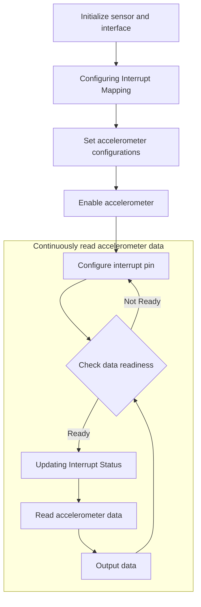
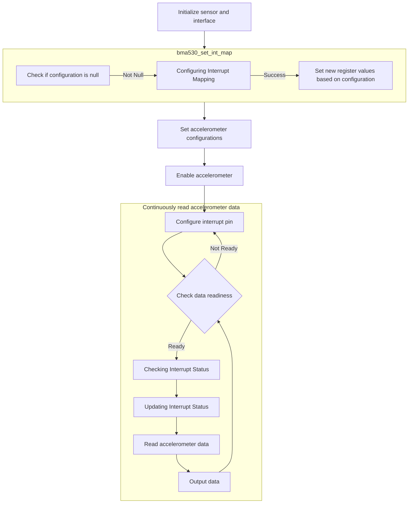
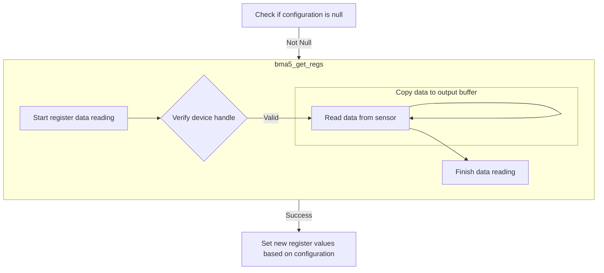
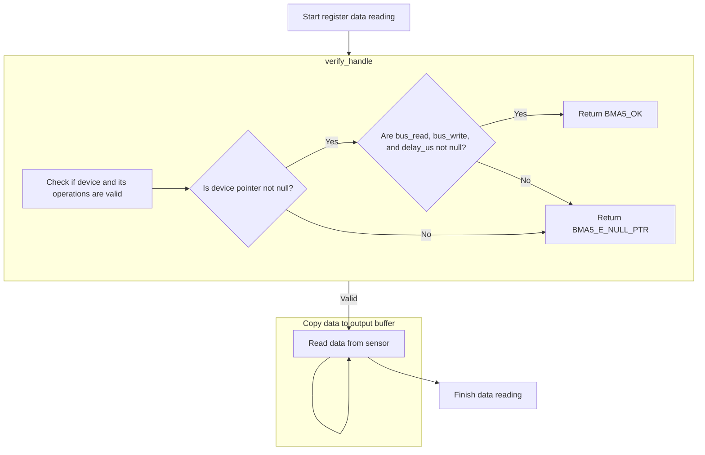
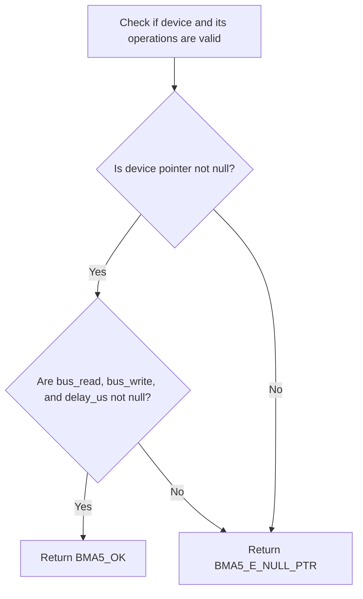
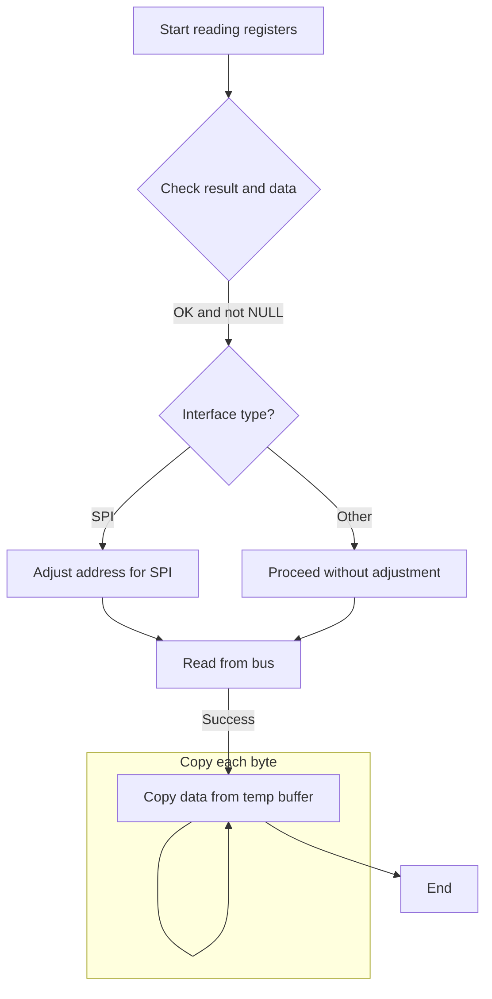
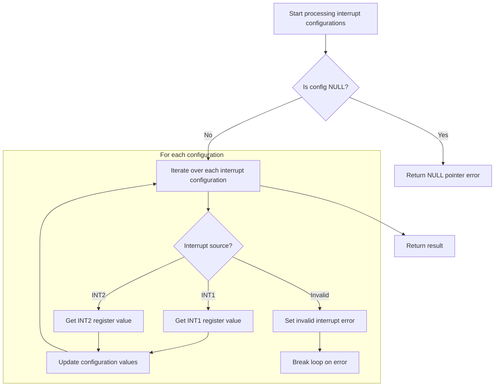
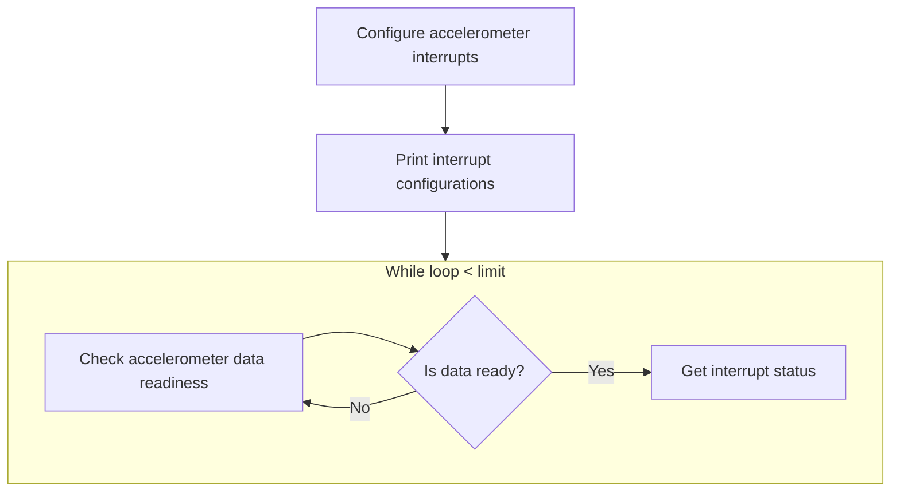
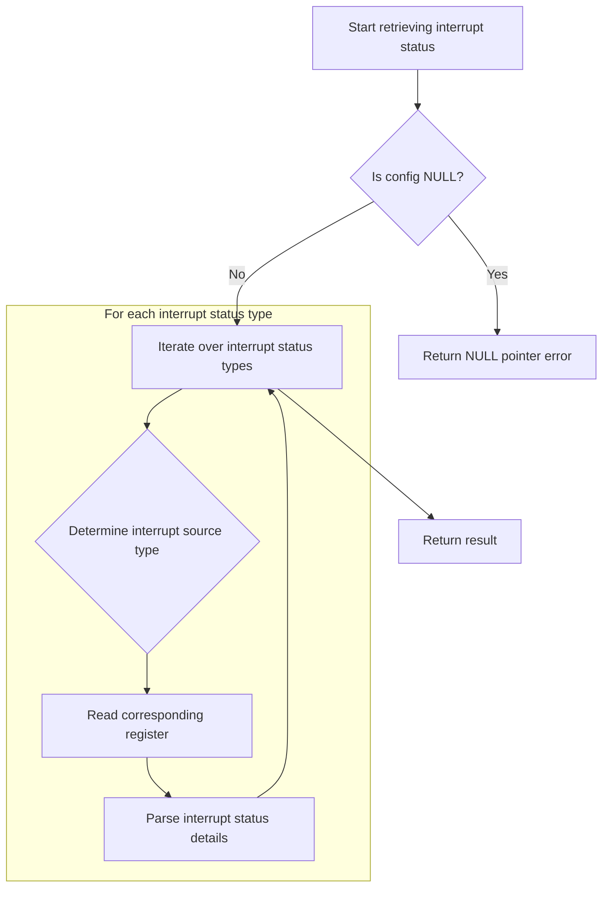
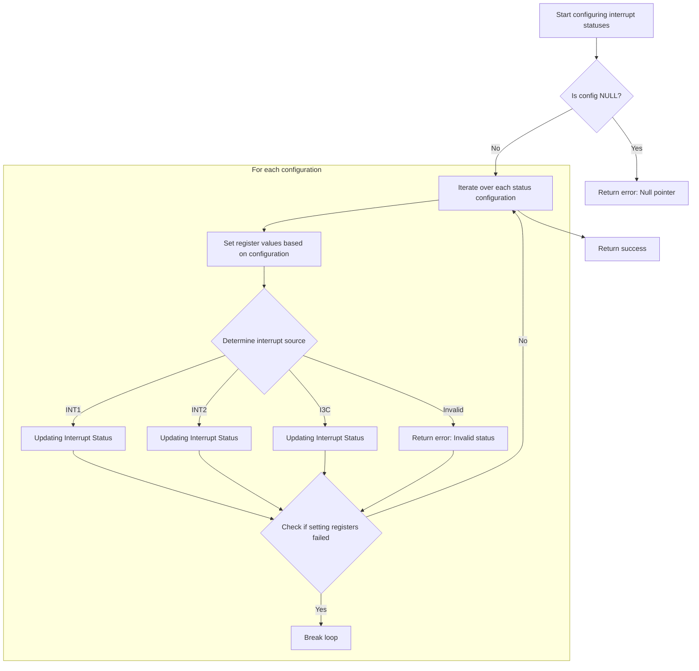

This document outlines the process of setting up the sensor to continuously read and output accelerometer data. The flow involves initializing the sensor and interface, configuring interrupt mapping, setting accelerometer configurations, and enabling the accelerometer. It then configures the interrupt pin and continuously reads accelerometer data, checking data readiness, updating interrupt status, and outputting the data.



# Initializing and Configuring the Sensor



<SwmSnippet path="/examples/accelerometer/accelerometer.c" line="62" repo-id="Z2l0aHViJTNBJTNBQk1BNTMwX1NlbnNvckFQSSUzQSUzQVNoYW50YW51TWFuZHBlLUJvc2No">

---

First, the main function initializes the sensor interface and the sensor itself. It retrieves the current interrupt map configuration and modifies it to map the accelerometer data ready interrupt. This setup is crucial to ensure that the system is notified when new accelerometer data is available, allowing for timely data processing.

```c
int main(void)
{
    int8_t rslt;
    uint8_t sensor_ctrl;
    uint8_t n_conf = 1;
    uint8_t n_status = 1;
    uint8_t loop = 0;
    uint8_t limit = 50;
    float x = 0, y = 0, z = 0;

    struct bma5_acc_conf acc_cfg;
    struct bma530_int_map int_map;
    struct bma5_accel sens_data;
    struct bma5_sensor_status status;
    struct bma5_int_conf_types int_config;
    struct bma530_int_status_types int_status;
    struct bma5_dev dev;

    /* Assign context parameter selection */
    enum bma5_context context;

    context = BMA5_SMARTPHONE;

    int_config.int_src = BMA5_INT_1;
    int_status.int_src = BMA530_INT_STATUS_INT1;

    /* Interface reference is given as a parameter
     *         For I2C : BMA5_I2C_INTF
     *         For SPI : BMA5_SPI_INTF
     */
    rslt = bma5_interface_init(&dev, BMA5_I2C_INTF, context);
    bma5_check_rslt("bma5_interface_init", rslt);

    rslt = bma530_init(&dev);
    bma5_check_rslt("bma530_init", rslt);
    printf("Chip ID:0x%x\n\n", dev.chip_id);

    /* Map generic interrupts to hardware interrupt pin of the sensor */
    rslt = bma530_get_int_map(&int_map, &dev);
    bma5_check_rslt("bma530_get_int_map", rslt);

    /* Map accel data ready interrupt */
    int_map.acc_drdy_int_map = BMA530_ACC_DRDY_INT_MAP_INT1;
    rslt = bma530_set_int_map(&int_map, &dev);
```

---

</SwmSnippet>

## Configuring Interrupt Mapping



<SwmSnippet path="/bma530.c" line="261" repo-id="Z2l0aHViJTNBJTNBQk1BNTMwX1NlbnNvckFQSSUzQSUzQVNoYW50YW51TWFuZHBlLUJvc2No">

---

Here, the function checks for a null configuration pointer and prepares to read the current register values. It calls bma5_get_regs to retrieve these values, ensuring that the new interrupt map configuration is applied correctly without overwriting other unrelated register values.

```c
int8_t bma530_set_int_map(const struct bma530_int_map *config, struct bma5_dev *dev)
{
    /* Function execution status */
    int8_t result;

    /* Temporary variable to store the register value to be set */
    uint8_t reg_value[4] = { 0 };

    uint8_t acc_drdy_int_map, fifo_wm_int_map, fifo_full_int_map, gen_int1_int_map;
    uint8_t gen_int2_int_map, gen_int3_int_map, step_det_int_map, step_cnt_int_map;
    uint8_t sig_mo_int_map, tilt_int_map, orient_int_map, acc_foc_int_map;

    if (NULL == config)
    {
        result = BMA5_E_NULL_PTR;
    }
    else
    {
        result = bma5_get_regs(BMA530_REG_INT_MAP_0, reg_value, 4, dev);

```

---

</SwmSnippet>

### Reading Register Values



<SwmSnippet path="/bma5.c" line="1333" repo-id="Z2l0aHViJTNBJTNBQk1BNTMwX1NlbnNvckFQSSUzQSUzQVNoYW50YW51TWFuZHBlLUJvc2No">

---

First, the function reads data from the specified register address. It calls verify_handle to check the validity of the device handle, ensuring readiness for communication and preventing errors.

```c
 * @brief This API reads the data from the given register address of bma5
 *        sensor.
 */
int8_t bma5_get_regs(uint8_t addr, uint8_t *data, uint32_t len, struct bma5_dev *dev)
{
    /* Function execution status */
    int8_t result;

    /* Temporary buffer to receive the serial data from sensor */
    uint8_t temp_buf[BMA5_MAX_BUFFER_SIZE] = { 0 };

    /* Number of bytes to be copied from temp_buf to data */
    uint32_t bytes_to_copy = len;

    result = verify_handle(dev);
```

---

</SwmSnippet>

#### Validating Device Handle



<SwmSnippet path="/bma5.c" line="1698" repo-id="Z2l0aHViJTNBJTNBQk1BNTMwX1NlbnNvckFQSSUzQSUzQVNoYW50YW51TWFuZHBlLUJvc2No">

---

The function returns a success status if the device pointer and its function pointers are valid; otherwise, it returns an error for a null pointer.

```c
/*********************** Static function definitions **************************/
/******************************************************************************/
static int8_t verify_handle(const struct bma5_dev *dev)
{
    /* Function execution status */
    int8_t result = BMA5_E_NULL_PTR;

    if (NULL != dev)
    {
        if ((NULL != dev->bus_read) && (NULL != dev->bus_write) && (NULL != dev->delay_us))
        {
            result = BMA5_OK;
        }
    }

    return result;
}
```

---

</SwmSnippet>

#### Processing Register Read



<SwmSnippet path="/bma5.c" line="1348" repo-id="Z2l0aHViJTNBJTNBQk1BNTMwX1NlbnNvckFQSSUzQSUzQVNoYW50YW51TWFuZHBlLUJvc2No">

---

Back in bma5_get_regs, after verify_handle confirms the device is ready, the function checks the data pointer and reads the register values from the sensor.

```c
    if ((BMA5_OK == result) && (NULL == data))
    {
        result = BMA5_E_NULL_PTR;
    }

    if (BMA5_OK == result)
    {
        /* Configuring register address for SPI Interface */
        if (BMA5_SPI_INTF == dev->intf)
        {
            addr = addr | BMA5_SPI_RD_MSK;
        }

        dev->intf_rslt = dev->bus_read(addr, temp_buf, (len + dev->dummy_byte), dev->intf_ptr);

        if (BMA5_INTF_RET_SUCCESS != dev->intf_rslt)
        {
            result = BMA5_E_COM_FAIL;
        }
    }

    if (BMA5_OK == result)
    {
        while (bytes_to_copy--)
        {
            data[bytes_to_copy] = temp_buf[bytes_to_copy + dev->dummy_byte];
        }
```

---

</SwmSnippet>

### Updating Interrupt Map Registers

<SwmSnippet path="/bma530.c" line="281" repo-id="Z2l0aHViJTNBJTNBQk1BNTMwX1NlbnNvckFQSSUzQSUzQVNoYW50YW51TWFuZHBlLUJvc2No">

---

Back in bma530_set_int_map, after retrieving current register values, the function updates them with the new interrupt map configuration and calls bma5_set_regs to apply these changes to the sensor.

```c
        if (BMA5_OK == result)
        {
            /* Bring up the register value to be set, as per the input details */
            acc_drdy_int_map =
                (BMA5_SET_BITS_POS_0(reg_value[0], BMA530_ACC_DRDY_INT_MAP,
                                     config->acc_drdy_int_map) & BMA530_ACC_DRDY_INT_MAP_MSK);
            fifo_wm_int_map =
                (BMA5_SET_BITS(reg_value[0], BMA530_FIFO_WM_INT_MAP,
                               config->fifo_wm_int_map) & BMA530_FIFO_WM_INT_MAP_MSK);
            fifo_full_int_map =
                (BMA5_SET_BITS(reg_value[0], BMA530_FIFO_FULL_INT_MAP,
                               config->fifo_full_int_map) & BMA530_FIFO_FULL_INT_MAP_MSK);
            gen_int1_int_map =
                (BMA5_SET_BITS(reg_value[0], BMA530_GEN_INT1_INT_MAP,
                               config->gen_int1_int_map) & BMA530_GEN_INT1_INT_MAP_MSK);

            reg_value[0] = (uint8_t)(acc_drdy_int_map | fifo_wm_int_map | fifo_full_int_map | gen_int1_int_map);

            gen_int2_int_map =
                (BMA5_SET_BITS_POS_0(reg_value[1], BMA530_GEN_INT2_INT_MAP,
                                     config->gen_int2_int_map) & BMA530_GEN_INT2_INT_MAP_MSK);
            gen_int3_int_map =
                (BMA5_SET_BITS(reg_value[1], BMA530_GEN_INT3_INT_MAP,
                               config->gen_int3_int_map) & BMA530_GEN_INT3_INT_MAP_MSK);
            step_det_int_map =
                (BMA5_SET_BITS(reg_value[1], BMA530_STEP_DET_INT_MAP,
                               config->step_det_int_map) & BMA530_STEP_DET_INT_MAP_MSK);
            step_cnt_int_map =
                (BMA5_SET_BITS(reg_value[1], BMA530_STEP_CNT_INT_MAP,
                               config->step_cnt_int_map) & BMA530_STEP_CNT_INT_MAP_MSK);

            reg_value[1] = (uint8_t)(gen_int2_int_map | gen_int3_int_map | step_det_int_map | step_cnt_int_map);

            sig_mo_int_map =
                (BMA5_SET_BITS_POS_0(reg_value[2], BMA530_SIG_MO_INT_MAP,
                                     config->sig_mo_int_map) & BMA530_SIG_MO_INT_MAP_MSK);
            tilt_int_map =
                (BMA5_SET_BITS(reg_value[2], BMA530_TILT_INT_MAP, config->tilt_int_map) & BMA530_TILT_INT_MAP_MSK);
            orient_int_map =
                (BMA5_SET_BITS(reg_value[2], BMA530_ORIENT_INT_MAP,
                               config->orient_int_map) & BMA530_ORIENT_INT_MAP_MSK);
            acc_foc_int_map =
                (BMA5_SET_BITS(reg_value[2], BMA530_ACC_FOC_INT_MAP,
                               config->acc_foc_int_map) & BMA530_ACC_FOC_INT_MAP_MSK);

            reg_value[2] = (uint8_t)(sig_mo_int_map | tilt_int_map | orient_int_map | acc_foc_int_map);

            reg_value[3] = BMA5_SET_BITS_POS_0(reg_value[3], BMA530_FEAT_ENG_ERR_INT_MAP, config->feat_eng_err_int_map);

            result = bma5_set_regs(BMA530_REG_INT_MAP_0, reg_value, 4, dev);
        }
    }

    return result;
}
```

---

</SwmSnippet>

## Writing Register Values

<SwmSnippet path="/bma5.c" line="1381" repo-id="Z2l0aHViJTNBJTNBQk1BNTMwX1NlbnNvckFQSSUzQSUzQVNoYW50YW51TWFuZHBlLUJvc2No">

---

First, the function writes data to the specified register address. It calls verify_handle to check the validity of the device handle, ensuring readiness for communication and preventing errors.

```c
 * @brief This API writes data to the given register address of bma5 sensor.
 */
int8_t bma5_set_regs(uint8_t addr, const uint8_t *data, uint32_t len, struct bma5_dev *dev)
{
    /* Function execution status */
    int8_t result;

    result = verify_handle(dev);
```

---

</SwmSnippet>

<SwmSnippet path="/bma5.c" line="1389" repo-id="Z2l0aHViJTNBJTNBQk1BNTMwX1NlbnNvckFQSSUzQSUzQVNoYW50YW51TWFuZHBlLUJvc2No">

---

Back in bma5_set_regs, after verify_handle confirms the device is ready, the function checks the data pointer and writes the register values to the sensor.

```c
    if ((BMA5_OK == result) && (NULL == data))
    {
        result = BMA5_E_NULL_PTR;
    }

    if (BMA5_OK == result)
    {
        /* Configuring register address for SPI Interface */
        if (BMA5_SPI_INTF == dev->intf)
        {
            addr = (addr & BMA5_SPI_WR_MSK);
        }

        dev->intf_rslt = dev->bus_write(addr, data, len, dev->intf_ptr);

        if (BMA5_INTF_RET_SUCCESS != dev->intf_rslt)
        {
            result = BMA5_E_COM_FAIL;
        }
    }

    return result;
}
```

---

</SwmSnippet>

## Configuring Accelerometer Settings

<SwmSnippet path="/examples/accelerometer/accelerometer.c" line="106" repo-id="Z2l0aHViJTNBJTNBQk1BNTMwX1NlbnNvckFQSSUzQSUzQVNoYW50YW51TWFuZHBlLUJvc2No">

---

Back in main, after setting the interrupt map, the function retrieves and updates the accelerometer configuration, enables it, and calls bma5_get_int_conf to get the current interrupt configuration.

```c
    bma5_check_rslt("bma530_set_int_map", rslt);

    /* Get accel configurations */
    rslt = bma5_get_acc_conf_0(&sensor_ctrl, &dev);
    bma5_check_rslt("bma5_get_acc_conf_0", rslt);

    rslt = bma5_get_acc_conf(&acc_cfg, &dev);
    bma5_check_rslt("bma5_get_acc_conf", rslt);

    /* Set accel configurations */
    acc_cfg.acc_odr = BMA5_ACC_ODR_HZ_25;
    acc_cfg.acc_bwp = BMA5_ACC_BWP_NORM_AVG4;
    acc_cfg.power_mode = BMA5_POWER_MODE_HPM;

    acc_cfg.acc_range = BMA5_ACC_RANGE_MAX_2G;
    acc_cfg.acc_iir_ro = BMA5_ACC_IIR_RO_DB_40;
    acc_cfg.noise_mode = BMA5_NOISE_MODE_LOWER_POWER;
    acc_cfg.acc_drdy_int_auto_clear = BMA5_ACC_DRDY_INT_AUTO_CLEAR_ENABLED;

    rslt = bma5_set_acc_conf(&acc_cfg, &dev);
    bma5_check_rslt("bma5_set_acc_conf", rslt);

    printf("\nAccel configurations\n");
    printf("ODR : %s\t\n", enum_to_string(BMA5_ACC_ODR_HZ_25));
    printf("BWP : %s\t\n", enum_to_string(BMA5_ACC_BWP_NORM_AVG4));
    printf("Power mode : %s\t\n", enum_to_string(BMA5_POWER_MODE_HPM));
    printf("Range : %s\t\n", enum_to_string(BMA5_ACC_RANGE_MAX_2G));
    printf("IIR filter : %s\t\n", enum_to_string(BMA5_ACC_IIR_RO_DB_40));
    printf("Noise mode : %s\t\n", enum_to_string(BMA5_NOISE_MODE_LOWER_POWER));
    printf("Data ready interrupt auto clear : %s\t\n", enum_to_string(BMA5_ACC_DRDY_INT_AUTO_CLEAR_ENABLED));

    /* Enable accel */
    sensor_ctrl = BMA5_SENSOR_CTRL_ENABLE;

    rslt = bma5_set_acc_conf_0(sensor_ctrl, &dev);
    bma5_check_rslt("bma5_set_acc_conf_0", rslt);

    if (rslt == BMA5_OK)
    {
        printf("\nAccel enabled\n");
    }

    /* Map hardware interrupt pin configurations */
    rslt = bma5_get_int_conf(&int_config, n_conf, &dev);
```

---

</SwmSnippet>

## Retrieving Interrupt Configuration



<SwmSnippet path="/bma5.c" line="547" repo-id="Z2l0aHViJTNBJTNBQk1BNTMwX1NlbnNvckFQSSUzQSUzQVNoYW50YW51TWFuZHBlLUJvc2No">

---

First, the function checks for a null configuration pointer and iterates over the interrupt configurations. It calls bma5_get_regs to read the register values for each configuration.

```c
int8_t bma5_get_int_conf(struct bma5_int_conf_types *config, uint8_t int_configs, struct bma5_dev *dev)
{
    /* Function execution status */
    int8_t result = BMA5_OK;
    uint8_t loop;

    /* Temporary variable to carry the register value */
    uint8_t reg_value;

    if (NULL == config)
    {
        result = BMA5_E_NULL_PTR;
    }
    else
    {
        for (loop = 0; loop < int_configs; loop++)
        {
            if (config[loop].int_src == BMA5_INT_1)
            {
                result = bma5_get_regs(BMA5_REG_INT1_CONF, &reg_value, sizeof(reg_value), dev);
            }
```

---

</SwmSnippet>

<SwmSnippet path="/bma5.c" line="568" repo-id="Z2l0aHViJTNBJTNBQk1BNTMwX1NlbnNvckFQSSUzQSUzQVNoYW50YW51TWFuZHBlLUJvc2No">

---

Back in the function, after reading the register values, it checks the interrupt source and calls bma5_get_regs for the next configuration.

```c
            else if (config[loop].int_src == BMA5_INT_2)
            {
                result = bma5_get_regs(BMA5_REG_INT2_CONF, &reg_value, sizeof(reg_value), dev);
            }
```

---

</SwmSnippet>

<SwmSnippet path="/bma5.c" line="572" repo-id="Z2l0aHViJTNBJTNBQk1BNTMwX1NlbnNvckFQSSUzQSUzQVNoYW50YW51TWFuZHBlLUJvc2No">

---

Back in the function, after reading the register values, it updates the configuration values and parses the details from the serial data.

```c
            else
            {
                result = BMA5_E_INVALID_INTERRUPT;
            }

            /* Update the config values. */
            if (BMA5_OK != result)
            {
                break;
            }

            /* Parse needed details from received serial data */
            config[loop].int_conf.int_mode = BMA5_GET_BITS_POS_0(reg_value, BMA5_INT_MODE);
            config[loop].int_conf.int_od = BMA5_GET_BITS(reg_value, BMA5_INT_OD);
            config[loop].int_conf.int_lvl = BMA5_GET_BITS(reg_value, BMA5_INT_LVL);
        }
    }

    return result;
}
```

---

</SwmSnippet>

## Setting Interrupt Configuration



<SwmSnippet path="/examples/accelerometer/accelerometer.c" line="150" repo-id="Z2l0aHViJTNBJTNBQk1BNTMwX1NlbnNvckFQSSUzQSUzQVNoYW50YW51TWFuZHBlLUJvc2No">

---

Back in main, after retrieving the interrupt configuration, the function updates it with the desired settings and calls bma530_get_int_status to check the current interrupt status.

```c
    bma5_check_rslt("bma5_get_int_conf", rslt);

    int_config.int_conf.int_mode = BMA5_INT1_MODE_LATCHED;
    int_config.int_conf.int_od = BMA5_INT1_OD_PUSH_PULL;
    int_config.int_conf.int_lvl = BMA5_INT1_LVL_ACTIVE_HIGH;

    rslt = bma5_set_int_conf(&int_config, n_conf, &dev);
    bma5_check_rslt("bma5_set_int_conf", rslt);

    printf("\nInterrupt configurations\n");
    printf("Int1 mode : %s\t\n", enum_to_string(BMA5_INT1_MODE_LATCHED));
    printf("Int1 output type : %s\t\n", enum_to_string(BMA5_INT1_OD_PUSH_PULL));
    printf("Int1 level : %s\t\n", enum_to_string(BMA5_INT1_LVL_ACTIVE_HIGH));

    printf("\nCount, Accel_LSB_X, Accel_LSB_Y, Accel_LSB_Z, Acc_ms2_X, Acc_ms2_Y, Acc_ms2_Z\n");

    while (loop < limit)
    {
        /* Get accel data ready status */
        rslt = bma5_get_sensor_status(&status, &dev);
        bma5_check_rslt("bma5_get_sensor_status", rslt);

        if (status.acc_data_rdy)
        {
            /* Get accel data ready interrupt status */
            rslt = bma530_get_int_status(&int_status, n_status, &dev);
```

---

</SwmSnippet>

## Checking Interrupt Status



<SwmSnippet path="/bma530.c" line="72" repo-id="Z2l0aHViJTNBJTNBQk1BNTMwX1NlbnNvckFQSSUzQSUzQVNoYW50YW51TWFuZHBlLUJvc2No">

---

First, the function checks for a null configuration pointer and iterates over the interrupt statuses. It calls bma5_get_regs to read the register values for each status.

```c
int8_t bma530_get_int_status(struct bma530_int_status_types *config, uint8_t n_status, struct bma5_dev *dev)
{
    /* Function execution status */
    int8_t result = BMA5_OK;
    uint8_t loop;

    /* Temporary variable to carry the register value */
    uint8_t reg_value[2] = { 0 };

    if (NULL == config)
    {
        result = BMA5_E_NULL_PTR;
    }
    else
    {
        for (loop = 0; loop < n_status; loop++)
        {
            switch (config[loop].int_src)
            {
                case BMA530_INT_STATUS_INT1:
                    result = bma5_get_regs(BMA530_REG_INT_STATUS_INT1_0, reg_value, 2, dev);
                    break;

```

---

</SwmSnippet>

<SwmSnippet path="/bma530.c" line="95" repo-id="Z2l0aHViJTNBJTNBQk1BNTMwX1NlbnNvckFQSSUzQSUzQVNoYW50YW51TWFuZHBlLUJvc2No">

---

Back in the function, after reading the register values, it checks the interrupt source and calls bma5_get_regs for the next status.

```c
                case BMA530_INT_STATUS_INT2:
                    result = bma5_get_regs(BMA530_REG_INT_STATUS_INT2_0, reg_value, 2, dev);
                    break;

```

---

</SwmSnippet>

<SwmSnippet path="/bma530.c" line="99" repo-id="Z2l0aHViJTNBJTNBQk1BNTMwX1NlbnNvckFQSSUzQSUzQVNoYW50YW51TWFuZHBlLUJvc2No">

---

Back in the function, after reading the register values, it checks the interrupt source and calls bma5_get_regs for the next status.

```c
                case BMA530_INT_STATUS_I3C:
                    result = bma5_get_regs(BMA530_REG_INT_STATUS_I3C_0, reg_value, 2, dev);
                    break;

```

---

</SwmSnippet>

<SwmSnippet path="/bma530.c" line="103" repo-id="Z2l0aHViJTNBJTNBQk1BNTMwX1NlbnNvckFQSSUzQSUzQVNoYW50YW51TWFuZHBlLUJvc2No">

---

Back in the function, after reading the register values, it updates the interrupt status values and parses the details from the serial data.

```c
                default:
                    result = BMA5_E_INVALID_INT_STATUS;
                    break;
            }

            if (BMA5_OK != result)
            {
                break;
            }

            /* Parse needed details from received serial data */
            config[loop].int_status.acc_drdy_int_status = BMA5_GET_BITS_POS_0(reg_value[0], BMA530_ACC_DRDY_INT_STATUS);
            config[loop].int_status.fifo_wm_int_status = BMA5_GET_BITS(reg_value[0], BMA530_FIFO_WM_INT_STATUS);
            config[loop].int_status.fifo_full_int_status = BMA5_GET_BITS(reg_value[0], BMA530_FIFO_FULL_INT_STATUS);
            config[loop].int_status.gen_int1_int_status = BMA5_GET_BITS(reg_value[0], BMA530_GEN_INT1_INT_STATUS);
            config[loop].int_status.gen_int2_int_status = BMA5_GET_BITS(reg_value[0], BMA530_GEN_INT2_INT_STATUS);
            config[loop].int_status.gen_int3_int_status = BMA5_GET_BITS(reg_value[0], BMA530_GEN_INT3_INT_STATUS);
            config[loop].int_status.step_det_int_status = BMA5_GET_BITS(reg_value[0], BMA530_STEP_DET_INT_STATUS);
            config[loop].int_status.step_cnt_int_status = BMA5_GET_BITS(reg_value[0], BMA530_STEP_CNT_INT_STATUS);

            config[loop].int_status.sig_mo_int_status = BMA5_GET_BITS_POS_0(reg_value[1], BMA530_SIG_MO_INT_STATUS);
            config[loop].int_status.tilt_int_status = BMA5_GET_BITS(reg_value[1], BMA530_TILT_INT_STATUS);
            config[loop].int_status.orient_int_status = BMA5_GET_BITS(reg_value[1], BMA530_ORIENT_INT_STATUS);
            config[loop].int_status.acc_foc_int_status = BMA5_GET_BITS(reg_value[1], BMA530_ACC_FOC_INT_STATUS);
            config[loop].int_status.feat_eng_err_int_status =
                BMA5_GET_BITS(reg_value[1], BMA530_FEAT_ENG_ERR_INT_STATUS);
        }
    }

    return result;
}
```

---

</SwmSnippet>

## Handling Sensor Data

<SwmSnippet path="/examples/accelerometer/accelerometer.c" line="176" repo-id="Z2l0aHViJTNBJTNBQk1BNTMwX1NlbnNvckFQSSUzQSUzQVNoYW50YW51TWFuZHBlLUJvc2No">

---

Back in main, after checking the interrupt status, the function retrieves and converts the accelerometer data, then calls bma530_set_int_status to update the interrupt status.

```c
            bma5_check_rslt("bma530_get_int_status", rslt);

            /* Check if the data is ready */
            if (int_status.int_status.acc_drdy_int_status & BMA530_ACC_DRDY_INT_STATUS_MSK)
            {
                rslt = bma5_set_sensor_status(&status, &dev);
                bma5_check_rslt("bma5_set_sensor_status", rslt);

                rslt = bma530_set_int_status(&int_status, n_status, &dev);
```

---

</SwmSnippet>

## Updating Interrupt Status



<SwmSnippet path="/bma530.c" line="135" repo-id="Z2l0aHViJTNBJTNBQk1BNTMwX1NlbnNvckFQSSUzQSUzQVNoYW50YW51TWFuZHBlLUJvc2No">

---

First, the function checks for a null configuration pointer and iterates over the interrupt statuses. It prepares the register values and calls bma5_set_regs to update the interrupt status.

```c
int8_t bma530_set_int_status(const struct bma530_int_status_types *config, uint8_t n_status, struct bma5_dev *dev)
{
    /* Function execution status */
    int8_t result = BMA5_OK;
    uint8_t loop;

    /* Temporary variable to store the register value to be set */
    uint8_t reg_value[2] = { 0 };

    if (NULL == config)
    {
        result = BMA5_E_NULL_PTR;
    }
    else
    {
        for (loop = 0; loop < n_status; loop++)
        {
            /* Bring up the register value to be set, as per the input details */
            reg_value[0] = BMA5_SET_BITS_POS_0(reg_value[0],
                                               BMA530_ACC_DRDY_INT_STATUS,
                                               config[loop].int_status.acc_drdy_int_status);
            reg_value[0] = BMA5_SET_BITS(reg_value[0],
                                         BMA530_FIFO_WM_INT_STATUS,
                                         config[loop].int_status.fifo_wm_int_status);
            reg_value[0] = BMA5_SET_BITS(reg_value[0],
                                         BMA530_FIFO_FULL_INT_STATUS,
                                         config[loop].int_status.fifo_full_int_status);
            reg_value[0] = BMA5_SET_BITS(reg_value[0],
                                         BMA530_GEN_INT1_INT_STATUS,
                                         config[loop].int_status.gen_int1_int_status);
            reg_value[0] = BMA5_SET_BITS(reg_value[0],
                                         BMA530_GEN_INT2_INT_STATUS,
                                         config[loop].int_status.gen_int2_int_status);
            reg_value[0] = BMA5_SET_BITS(reg_value[0],
                                         BMA530_GEN_INT3_INT_STATUS,
                                         config[loop].int_status.gen_int3_int_status);
            reg_value[0] = BMA5_SET_BITS(reg_value[0],
                                         BMA530_STEP_DET_INT_STATUS,
                                         config[loop].int_status.step_det_int_status);
            reg_value[0] = BMA5_SET_BITS(reg_value[0],
                                         BMA530_STEP_CNT_INT_STATUS,
                                         config[loop].int_status.step_cnt_int_status);

            /* Bring up the register value to be set, as per the input details */
            reg_value[1] = BMA5_SET_BITS_POS_0(reg_value[1],
                                               BMA530_SIG_MO_INT_STATUS,
                                               config[loop].int_status.sig_mo_int_status);
            reg_value[1] = BMA5_SET_BITS(reg_value[1], BMA530_TILT_INT_STATUS, config[loop].int_status.tilt_int_status);
            reg_value[1] = BMA5_SET_BITS(reg_value[1],
                                         BMA530_ORIENT_INT_STATUS,
                                         config[loop].int_status.orient_int_status);
            reg_value[1] = BMA5_SET_BITS(reg_value[1],
                                         BMA530_ACC_FOC_INT_STATUS,
                                         config[loop].int_status.acc_foc_int_status);
            reg_value[1] = BMA5_SET_BITS(reg_value[1],
                                         BMA530_FEAT_ENG_ERR_INT_STATUS,
                                         config[loop].int_status.feat_eng_err_int_status);

            switch (config[loop].int_src)
            {
                case BMA530_INT_STATUS_INT1:
                    result = bma5_set_regs(BMA530_REG_INT_STATUS_INT1_0, reg_value, 2, dev);
                    break;

```

---

</SwmSnippet>

<SwmSnippet path="/bma530.c" line="199" repo-id="Z2l0aHViJTNBJTNBQk1BNTMwX1NlbnNvckFQSSUzQSUzQVNoYW50YW51TWFuZHBlLUJvc2No">

---

Back in the function, after updating the register values, it checks the interrupt source and calls bma5_set_regs for the next status.

```c
                case BMA530_INT_STATUS_INT2:
                    result = bma5_set_regs(BMA530_REG_INT_STATUS_INT2_0, reg_value, 2, dev);
                    break;

```

---

</SwmSnippet>

<SwmSnippet path="/bma530.c" line="203" repo-id="Z2l0aHViJTNBJTNBQk1BNTMwX1NlbnNvckFQSSUzQSUzQVNoYW50YW51TWFuZHBlLUJvc2No">

---

Back in the function, after updating the register values, it checks the interrupt source and calls bma5_set_regs for the next status.

```c
                case BMA530_INT_STATUS_I3C:
                    result = bma5_set_regs(BMA530_REG_INT_STATUS_I3C_0, reg_value, 2, dev);
                    break;
```

---

</SwmSnippet>

<SwmSnippet path="/bma530.c" line="206" repo-id="Z2l0aHViJTNBJTNBQk1BNTMwX1NlbnNvckFQSSUzQSUzQVNoYW50YW51TWFuZHBlLUJvc2No">

---

Back in the function, after updating the register values, it completes the update of the interrupt status values, ensuring the sensor is ready for the next data acquisition cycle.

```c
                default:
                    result = BMA5_E_INVALID_INT_STATUS;
            }

            if (BMA5_OK != result)
            {
                break;
            }
        }
    }

    return result;
}
```

---

</SwmSnippet>

## Finalizing Data Acquisition

<SwmSnippet path="/examples/accelerometer/accelerometer.c" line="185" repo-id="Z2l0aHViJTNBJTNBQk1BNTMwX1NlbnNvckFQSSUzQSUzQVNoYW50YW51TWFuZHBlLUJvc2No">

---

Back in main, after updating the interrupt status, the function retrieves and converts the accelerometer data, prints the results, and continues the data acquisition cycle if the limit is not reached.

```c
                bma5_check_rslt("bma530_set_int_status_int1_0", rslt);

                /* Get accel data and sensortime */
                rslt = bma5_get_acc(&sens_data, &dev);
                bma5_check_rslt("bma5_get_acc", rslt);

                /* Converting lsb to meter per second squared for 16 bit resolution at 2G range */
                x = lsb_to_ms2(sens_data.x, (float)2, BMA5_16_BIT_RESOLUTION);
                y = lsb_to_ms2(sens_data.y, (float)2, BMA5_16_BIT_RESOLUTION);
                z = lsb_to_ms2(sens_data.z, (float)2, BMA5_16_BIT_RESOLUTION);

                /* Print the data in m/s2 */
                printf("%4d  %11d  %11d  %11d  %9.2f  %9.2f  %9.2f\n",
                       loop,
                       sens_data.x,
                       sens_data.y,
                       sens_data.z,
                       x,
                       y,
                       z);

                loop++;
            }
        }
    }

    bma5_coines_deinit();

    return rslt;
}
```

---

</SwmSnippet>

&nbsp;

*This is an auto-generated document by Swimm 🌊 and has not yet been verified by a human*

<SwmMeta version="3.0.0"><sup>Powered by [Swimm](https://staging.swimm.cloud/)</sup></SwmMeta>
