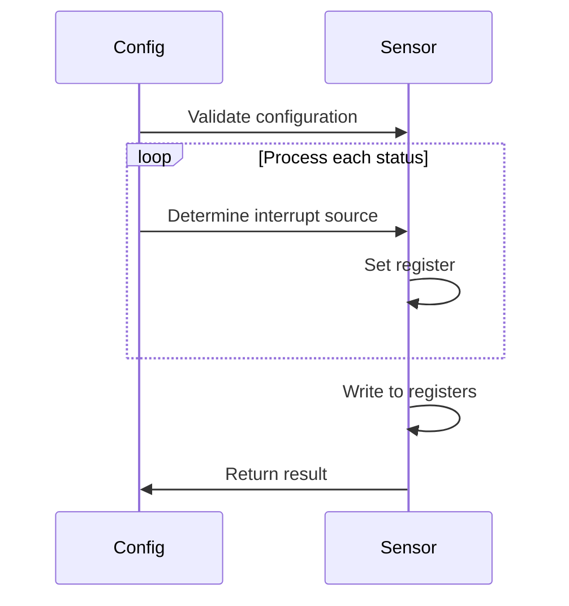
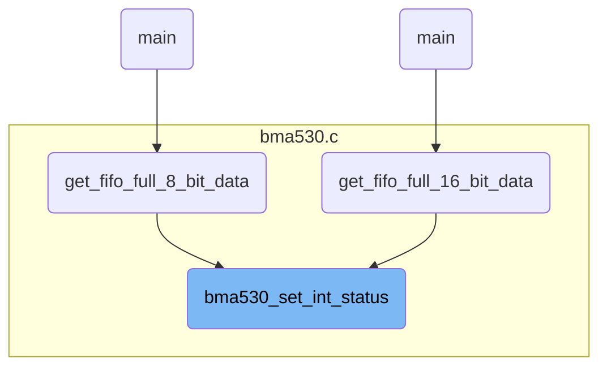
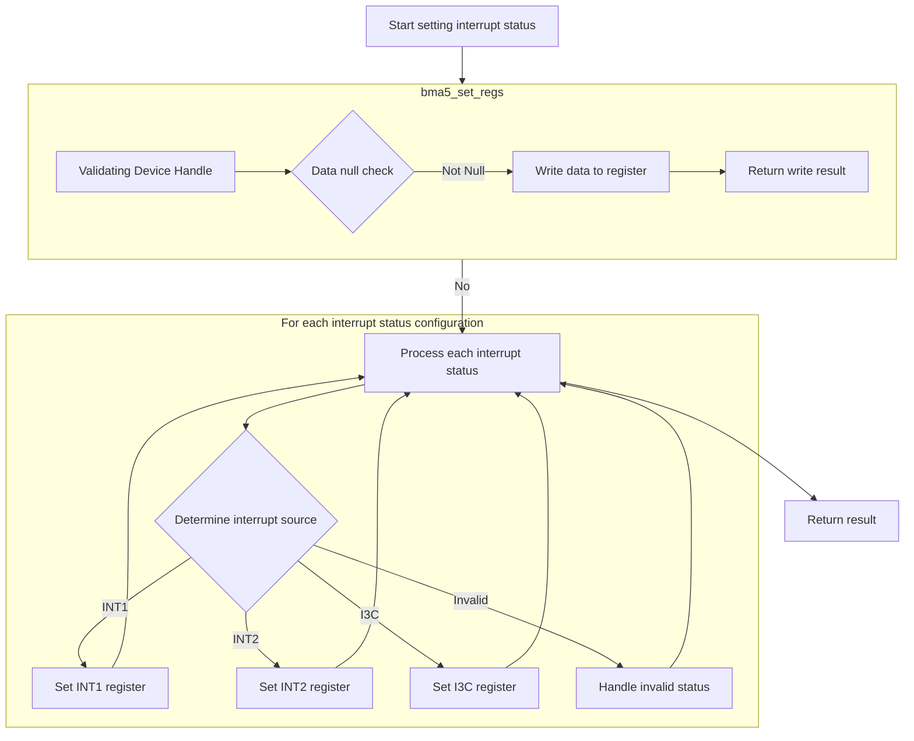
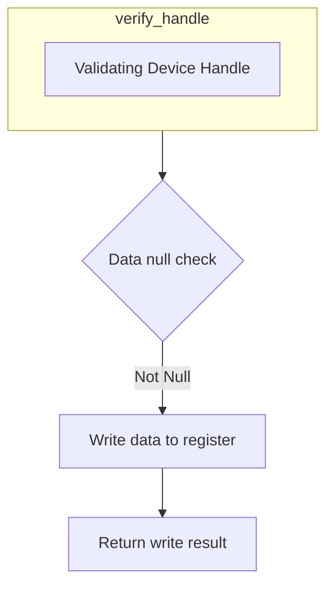
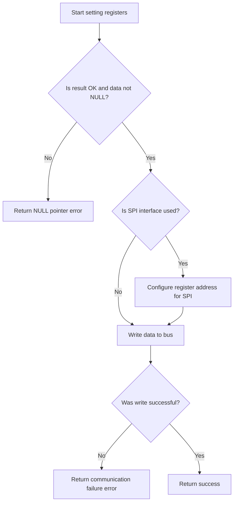

This document describes the process of setting interrupt statuses on the sensor. The flow involves validating the input configurations, processing each interrupt status, determining the interrupt source, and setting the appropriate registers. For example, if the configuration specifies an interrupt for data ready and FIFO full, the flow will set these statuses in the sensor's registers and return a success result.

The main steps are:

- Validate the configuration input.
- Process each interrupt status configuration.
- Determine the interrupt source.
- Set the appropriate register based on the interrupt source.
- Write the register values to the sensor.
- Return the result of the operation.



# Where is this flow used?

This flow is used multiple times in the codebase as represented in the following diagram:

(Note - these are only some of the entry points of this flow)



# Setting Interrupt Status



<SwmSnippet path="/bma530.c" line="135" repo-id="Z2l0aHViJTNBJTNBQk1BNTMwX1NlbnNvckFQSSUzQSUzQVNoYW50YW51TWFuZHBlLUJvc2No">

---

We start the flow by preparing the register values based on the provided configurations. Next, we call bma5_set_regs to write these values to the sensor's registers, which is necessary to update the interrupt status on the sensor.

```c
int8_t bma530_set_int_status(const struct bma530_int_status_types *config, uint8_t n_status, struct bma5_dev *dev)
{
    /* Function execution status */
    int8_t result = BMA5_OK;
    uint8_t loop;

    /* Temporary variable to store the register value to be set */
    uint8_t reg_value[2] = { 0 };

    if (NULL == config)
    {
        result = BMA5_E_NULL_PTR;
    }
    else
    {
        for (loop = 0; loop < n_status; loop++)
        {
            /* Bring up the register value to be set, as per the input details */
            reg_value[0] = BMA5_SET_BITS_POS_0(reg_value[0],
                                               BMA530_ACC_DRDY_INT_STATUS,
                                               config[loop].int_status.acc_drdy_int_status);
            reg_value[0] = BMA5_SET_BITS(reg_value[0],
                                         BMA530_FIFO_WM_INT_STATUS,
                                         config[loop].int_status.fifo_wm_int_status);
            reg_value[0] = BMA5_SET_BITS(reg_value[0],
                                         BMA530_FIFO_FULL_INT_STATUS,
                                         config[loop].int_status.fifo_full_int_status);
            reg_value[0] = BMA5_SET_BITS(reg_value[0],
                                         BMA530_GEN_INT1_INT_STATUS,
                                         config[loop].int_status.gen_int1_int_status);
            reg_value[0] = BMA5_SET_BITS(reg_value[0],
                                         BMA530_GEN_INT2_INT_STATUS,
                                         config[loop].int_status.gen_int2_int_status);
            reg_value[0] = BMA5_SET_BITS(reg_value[0],
                                         BMA530_GEN_INT3_INT_STATUS,
                                         config[loop].int_status.gen_int3_int_status);
            reg_value[0] = BMA5_SET_BITS(reg_value[0],
                                         BMA530_STEP_DET_INT_STATUS,
                                         config[loop].int_status.step_det_int_status);
            reg_value[0] = BMA5_SET_BITS(reg_value[0],
                                         BMA530_STEP_CNT_INT_STATUS,
                                         config[loop].int_status.step_cnt_int_status);

            /* Bring up the register value to be set, as per the input details */
            reg_value[1] = BMA5_SET_BITS_POS_0(reg_value[1],
                                               BMA530_SIG_MO_INT_STATUS,
                                               config[loop].int_status.sig_mo_int_status);
            reg_value[1] = BMA5_SET_BITS(reg_value[1], BMA530_TILT_INT_STATUS, config[loop].int_status.tilt_int_status);
            reg_value[1] = BMA5_SET_BITS(reg_value[1],
                                         BMA530_ORIENT_INT_STATUS,
                                         config[loop].int_status.orient_int_status);
            reg_value[1] = BMA5_SET_BITS(reg_value[1],
                                         BMA530_ACC_FOC_INT_STATUS,
                                         config[loop].int_status.acc_foc_int_status);
            reg_value[1] = BMA5_SET_BITS(reg_value[1],
                                         BMA530_FEAT_ENG_ERR_INT_STATUS,
                                         config[loop].int_status.feat_eng_err_int_status);

            switch (config[loop].int_src)
            {
                case BMA530_INT_STATUS_INT1:
                    result = bma5_set_regs(BMA530_REG_INT_STATUS_INT1_0, reg_value, 2, dev);
                    break;

```

---

</SwmSnippet>

## Writing to Sensor Registers



<SwmSnippet path="/bma5.c" line="1381" repo-id="Z2l0aHViJTNBJTNBQk1BNTMwX1NlbnNvckFQSSUzQSUzQVNoYW50YW51TWFuZHBlLUJvc2No">

---

Next, we write data to the specified register address. We call verify_handle to ensure the device structure is valid, which is necessary to prevent errors during the writing process.

```c
 * @brief This API writes data to the given register address of bma5 sensor.
 */
int8_t bma5_set_regs(uint8_t addr, const uint8_t *data, uint32_t len, struct bma5_dev *dev)
{
    /* Function execution status */
    int8_t result;

    result = verify_handle(dev);
```

---

</SwmSnippet>

### Validating Device Handle

<SwmSnippet path="/bma5.c" line="1698" repo-id="Z2l0aHViJTNBJTNBQk1BNTMwX1NlbnNvckFQSSUzQSUzQVNoYW50YW51TWFuZHBlLUJvc2No">

---

Returns BMA5_OK if the device structure is valid, otherwise returns BMA5_E_NULL_PTR.

```c
/*********************** Static function definitions **************************/
/******************************************************************************/
static int8_t verify_handle(const struct bma5_dev *dev)
{
    /* Function execution status */
    int8_t result = BMA5_E_NULL_PTR;

    if (NULL != dev)
    {
        if ((NULL != dev->bus_read) && (NULL != dev->bus_write) && (NULL != dev->delay_us))
        {
            result = BMA5_OK;
        }
    }

    return result;
}
```

---

</SwmSnippet>

### Handling Register Write Logic



<SwmSnippet path="/bma5.c" line="1389" repo-id="Z2l0aHViJTNBJTNBQk1BNTMwX1NlbnNvckFQSSUzQSUzQVNoYW50YW51TWFuZHBlLUJvc2No">

---

Back in bma5_set_regs, we check if the data pointer is NULL and configure the register address for SPI. We perform the bus write operation and return the result.

```c
    if ((BMA5_OK == result) && (NULL == data))
    {
        result = BMA5_E_NULL_PTR;
    }

    if (BMA5_OK == result)
    {
        /* Configuring register address for SPI Interface */
        if (BMA5_SPI_INTF == dev->intf)
        {
            addr = (addr & BMA5_SPI_WR_MSK);
        }

        dev->intf_rslt = dev->bus_write(addr, data, len, dev->intf_ptr);

        if (BMA5_INTF_RET_SUCCESS != dev->intf_rslt)
        {
            result = BMA5_E_COM_FAIL;
        }
    }

    return result;
}
```

---

</SwmSnippet>

## Processing Interrupt Source INT2

<SwmSnippet path="/bma530.c" line="199" repo-id="Z2l0aHViJTNBJTNBQk1BNTMwX1NlbnNvckFQSSUzQSUzQVNoYW50YW51TWFuZHBlLUJvc2No">

---

Back in the function, we process interrupt source INT2 and call bma5_set_regs to update the interrupt status.

```c
                case BMA530_INT_STATUS_INT2:
                    result = bma5_set_regs(BMA530_REG_INT_STATUS_INT2_0, reg_value, 2, dev);
                    break;

```

---

</SwmSnippet>

## Processing Interrupt Source I3C

<SwmSnippet path="/bma530.c" line="203" repo-id="Z2l0aHViJTNBJTNBQk1BNTMwX1NlbnNvckFQSSUzQSUzQVNoYW50YW51TWFuZHBlLUJvc2No">

---

Back in the function, we process interrupt source I3C and call bma5_set_regs to update the interrupt status.

```c
                case BMA530_INT_STATUS_I3C:
                    result = bma5_set_regs(BMA530_REG_INT_STATUS_I3C_0, reg_value, 2, dev);
                    break;
```

---

</SwmSnippet>

## Finalizing Interrupt Status Update

<SwmSnippet path="/bma530.c" line="206" repo-id="Z2l0aHViJTNBJTNBQk1BNTMwX1NlbnNvckFQSSUzQSUzQVNoYW50YW51TWFuZHBlLUJvc2No">

---

Back in the function, we check the result and break the loop on error, then return the result to complete the process.

```c
                default:
                    result = BMA5_E_INVALID_INT_STATUS;
            }

            if (BMA5_OK != result)
            {
                break;
            }
        }
    }

    return result;
}
```

---

</SwmSnippet>

&nbsp;

*This is an auto-generated document by Swimm 🌊 and has not yet been verified by a human*

<SwmMeta version="3.0.0"><sup>Powered by [Swimm](https://app.swimm.io/)</sup></SwmMeta>
